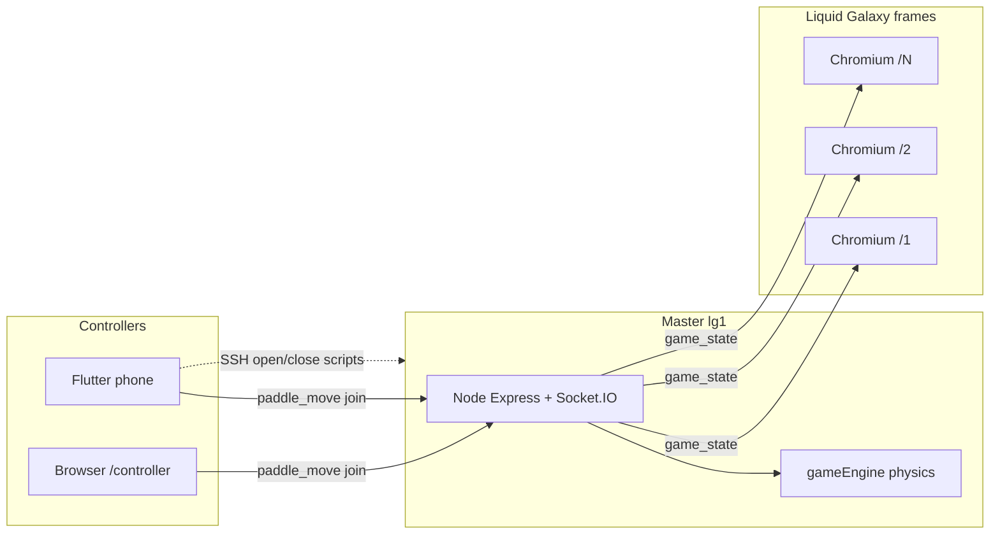
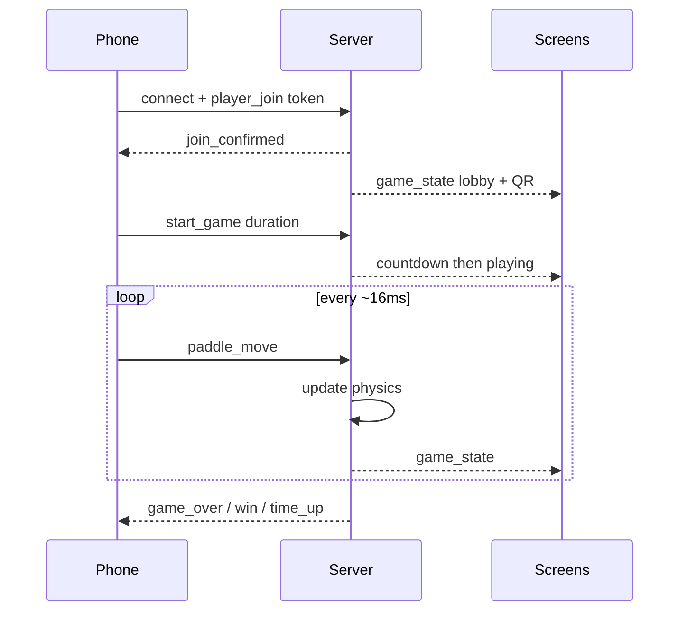
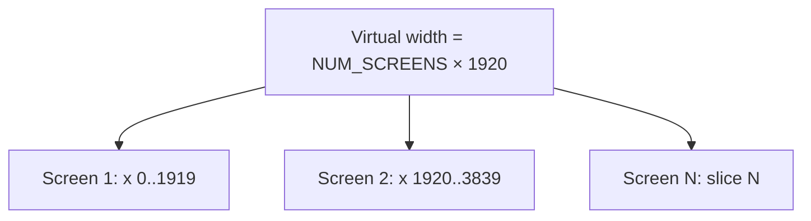

# LG Arkanoid

[](https://github.com/AnirudhPratapSinghYadav/LG-Arkanoid/actions/workflows/ci.yml)
[](#license)

**Panoramic multiplayer Arkanoid for [Liquid Galaxy](https://www.liquidgalaxy.eu/).**  
Phones are controllers. The Liquid Galaxy wall is the game screen.

Built for **Gemini Summer of Code 2026** · Liquid Galaxy Lab  
Author: [Anirudh Pratap Singh Yadav](https://github.com/AnirudhPratapSinghYadav)

---

## What is this?

LG Arkanoid turns a Liquid Galaxy rig into one continuous brick-breaker playfield. Instead of one monitor, the ball and bricks span **3, 5, 7, 9, or 12** physical screens stitched into a single virtual world (1920×1080 per screen).

Players join with Android phones. The phone never renders the level — it only sends paddle input. Physics, scoring, lives, levels, and power-ups run on an authoritative Node.js server on the master machine (`lg1`). Each screen opens Chromium in kiosk mode and draws only its slice of the world.

This follows the same deploy pattern as sister games such as [galaxy-pacman](https://github.com/LiquidGalaxyLAB/galaxy-pacman): **Node + pm2 on the master, Chromium on every frame, no Docker.**

---

## Who is it for?

| Audience | Use |
|----------|-----|
| Liquid Galaxy labs / museums | Install on a master node and launch across the wall |
| Mentors / LAB testing | `open-arkanoid.sh` + wall QR; Flutter APK built from `mobile/` (or browser `/controller`) |
| Contributors / students | Local multi-window Chromium + phone on Wi‑Fi |
| Open-source community | Reuse the panoramic Socket.IO + phone-controller pattern |

---

## Features

- Authoritative server physics (~60 Hz tick)
- Multi-screen handoff when the ball crosses bezels
- 1–5 players, phone controller (Flutter) + optional browser controller
- Lobby, countdown, timed or endless matches
- Power-ups: wide paddle, slow ball, multi-ball, bomb
- QR join (`LGARK|ip|port|token`) and SSH launch/close from the app
- Optional Gemini commentary (works offline with short fallback lines)
- Screen counts **1–12** (typical LG: 3 / 5 / 7 / 9 / 12)

---

## Architecture



### Game flow



### Virtual world



Each Phaser client receives the full world state but draws only `worldX - (screenId-1)*1920`.

---

## Tech stack

| Layer | Technology | Why |
|-------|------------|-----|
| Game server | Node.js **16+**, Express, Socket.IO 4 | Authoritative physics; works on older LG Ubuntu/glibc |
| Screen client | Phaser **3.80**, plain JS | Fullscreen 1920×1080 kiosk pages |
| Phone controller | Flutter **3.24.x**, Dart 3 | Touch paddle + SSH launch (same pattern as LG apps) |
| Process manager | pm2 | Keep server alive on the master |
| Display | Chromium `--kiosk` | Standard Liquid Galaxy browser launch |
| Optional AI | Gemini API | Commentary / level hints; not required to play |
| Build (dev) | Vite **4.5.x** | Locked for Node 16 compatibility |

### Supported versions

| Component | Supported | Notes |
|-----------|-----------|--------|
| Node.js | **16**, 18, 20 (CI) | Use **16** on Ubuntu 16.04 / glibc 2.23 rigs |
| npm | comes with Node 16+ | |
| Flutter | **3.24.3** (CI pin) | Dart SDK `>=3.0 <4.0` |
| Screen count | **1–12** | Common LG: 3, 5, 7, 9, 12 |
| Game port | **3000** | Dedicated port (Pacman uses 8128 — do not collide) |
| SSH | 22 | User typically `lg` |
| Vite | 4.x only | Do not upgrade to Vite 5+ on the rig |

**Do not Dockerize for LAB demos.** Mentors expect native pm2 + Chromium like Pacman / Asteroids.

---

## Repository layout

```
LG-Arkanoid/
├── server/           Authoritative game server (physics, sockets, routes)
├── web-client/       Phaser screen pages + optional browser controller
├── mobile/           Flutter phone controller
├── scripts/          open-arkanoid.sh / close-arkanoid.sh
├── docs/             Setup, networking, troubleshooting, VirtualBox plan
├── install.sh        Master-node installer
├── package.json      Workspace scripts (start / build / test)
└── .nvmrc            16.20.2
```

---

## Quick start (local, no rig)

```bash
git clone https://github.com/AnirudhPratapSinghYadav/LG-Arkanoid.git
cd LG-Arkanoid
npm install
cp server/.env.example server/.env   # set LG_PASSWORD=lg at minimum
npm start
```

Then open:

| URL | Purpose |
|-----|---------|
| http://localhost:3000/1 | Screen 1 |
| http://localhost:3000/2 | Screen 2 |
| http://localhost:3000/health | Status (no join code — code is on the wall QR only) |
| http://localhost:3000/controller | Browser paddle (optional) |

```bash
npm test          # game engine tests
npm run build     # production web assets → dist/
```

---

## Liquid Galaxy install

1. LG core installed ([liquid-galaxy](https://github.com/LiquidGalaxyLAB/liquid-galaxy))
2. Node **16** on master (`nvm install 16`)
3. `sudo npm i -g pm2`
4. Chromium on every frame
5. SSH from `lg@lg1` to slaves

```bash
cd ~/projects
git clone https://github.com/AnirudhPratapSinghYadav/LG-Arkanoid.git LG-Arkanoid
cd LG-Arkanoid
bash install.sh
bash scripts/open-arkanoid.sh 3
```

Stop:

```bash
bash scripts/close-arkanoid.sh
```

Phone: same Wi‑Fi → master IP, port **3000**, 4-character token from the **center-screen QR / session code** (not `/health` — join codes are screen-only for security).

Or open `http://<master-ip>:3000/controller` on a phone browser if you do not have the Flutter APK yet.

More detail: [docs/lg-setup.md](docs/lg-setup.md) · VirtualBox plan: [docs/virtualbox-test-plan.md](docs/virtualbox-test-plan.md)

---

## How the game logic works

1. **Lobby** — players join with a short session token; host configures duration / players / ball speed.
2. **Countdown** — 3 seconds, then `playing`.
3. **Tick** — server advances balls, paddles, bricks, power-ups every `TICK_MS` (16).
4. **Handoff** — when a ball’s X crosses a screen boundary, neighboring screens get `boundary_exit` / `boundary_enter`.
5. **Power-ups** — catch with the paddle; most go to phone inventory (tap to use); bomb fires on catch.
6. **End states** — `game_over` (no lives), `time_up` (timer), `win` (levels cleared). Loop stays alive so the next match can start.

---

## Environment

`server/.env` (see `server/.env.example`):

```
PORT=3000
NUM_SCREENS=3
LG_PASSWORD=lg
GEMINI_API_KEY=          # optional
```

---

## Documentation

- [Architecture](docs/architecture.md)
- [Liquid Galaxy setup](docs/lg-setup.md)
- [Mobile controller](docs/mobile-setup.md)
- [Networking](docs/networking.md)
- [Troubleshooting](docs/troubleshooting.md)
- [VirtualBox 3-rig test plan](docs/virtualbox-test-plan.md)

---

## Contributing

1. Use Node 16+ and Flutter 3.24.x when changing mobile.
2. Keep Vite on 4.x — required for LG Node 16.
3. Run `npm test` and `npm run build` before opening a PR.
4. Prefer small PRs that preserve the Pacman-style launch path.

Issues and pull requests are welcome.

---

## License

MIT — see repository license.  
Copyright © Anirudh Pratap Singh Yadav · Liquid Galaxy / Gemini SoC 2026.
