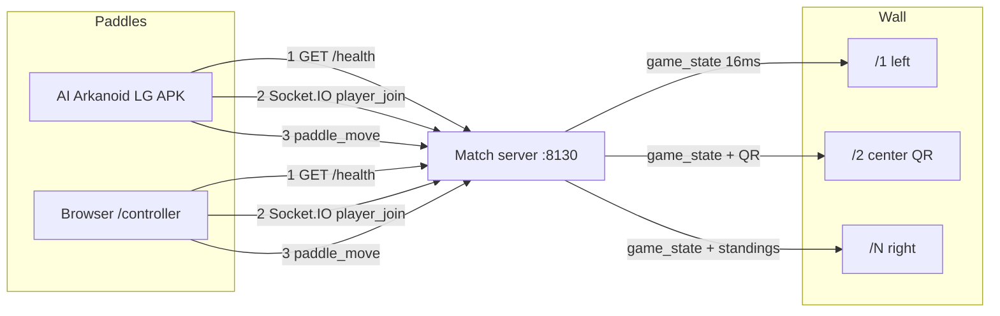
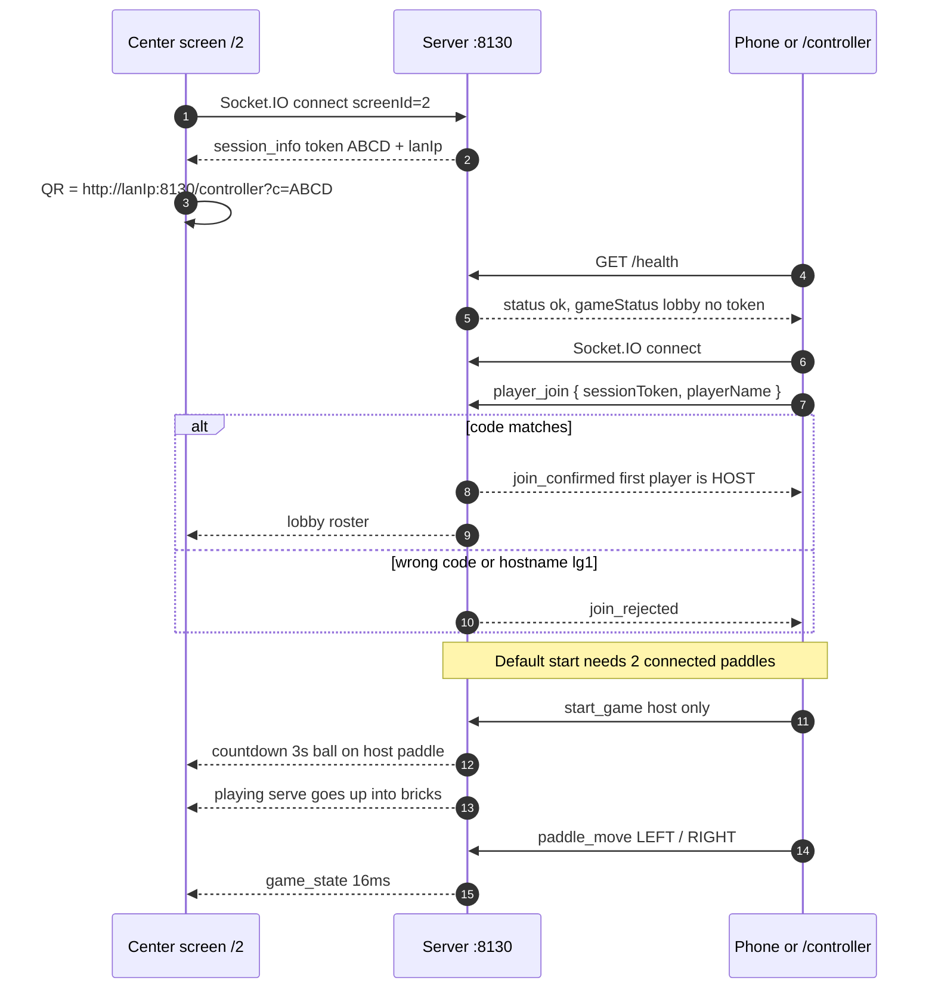
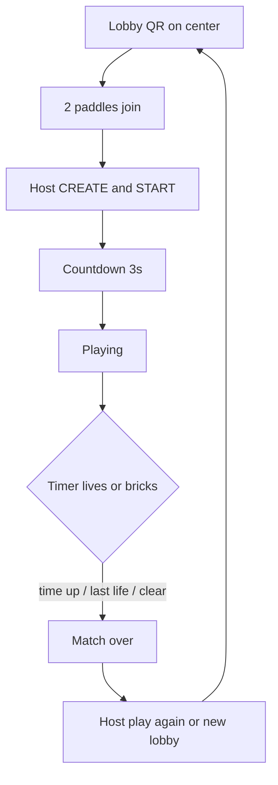
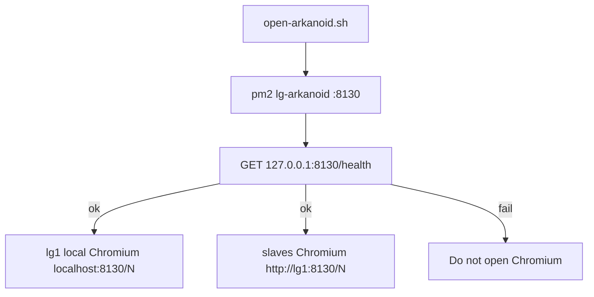

# LG Arkanoid

[](https://github.com/AnirudhPratapSinghYadav/LG-Arkanoid/actions/workflows/ci.yml)
[](LICENSE)
[](https://nodejs.org/)
[](https://flutter.dev/)

Panoramic multiplayer Arkanoid for a [Liquid Galaxy](https://www.liquidgalaxy.eu/) wall. Gemini Summer of Code 2026.

Phones (or a browser tab) are the paddles. Chromium draws one slice of one court per frame. One Node process on **port 8130** is the match.

| | |
|---|---|
| **Contributor** | [Anirudh Pratap Singh Yadav](https://github.com/AnirudhPratapSinghYadav) |
| **Mentor** | [Sidharth Mudgil](https://github.com/SidharthMudgil) |
| **Org** | Liquid Galaxy · Gemini Summer of Code 2026 |
| **Game port** | **8130** (HTTP + Socket.IO) |
| **SSH (rig only)** | **22** — opens Chromium. Never used to join a match. |

**Start here:** [A. Your computer](#a-run-on-your-computer) · [B. Phone](#b-run-on-the-phone) · [C. Liquid Galaxy wall](#c-run-on-a-liquid-galaxy-wall)

---

## How the whole game is connected

There is **one** match process. Screens subscribe as `screen-1` … `screen-N`. Controllers subscribe as paddles. `/health` is public but **never contains the join code**. The 4-letter code is pushed only to wall sockets, then printed as a real URL under the QR:

`http://<Wi-Fi-IPv4>:8130/controller?c=ABCD`



SSH (port 22) is **not** in that picture. It only starts or stops Chromium on a rig. After the wall is open, every paddle still joins on **8130**.





On a **Liquid Galaxy** rig, Chromium is opened after `/health` answers:



---

## Ports (do not mix)

| What | Port | Who uses it |
|---|---|---|
| Match, QR, `/controller`, `/health`, Socket.IO | **8130** | Phones, browsers, wall Chromium |
| Launch / close the wall from the app | **22** | Settings → CONNECT LG only |

Do not type hostname **`lg1`** on a phone. Do not put the join code in `/health`. Session codes skip `0 / O / 1 / I` so they are not misread.

Default lobby: **2** paddles must join before START (host can raise this to 5).

---

## A. Run on your computer

Full app on one machine: wall slices in the browser + paddle in another tab (or the phone).

### A1. What you need

- Git
- **Node.js 16 or newer** (`node -v`). 18 or 20 is fine on a laptop.
- Chrome / Edge / Firefox

Optional: Flutter **3.24.x** if you want the Android app instead of `/controller`.

### A2. Clone and install

```bash
git clone https://github.com/AnirudhPratapSinghYadav/LG-Arkanoid.git
cd LG-Arkanoid
npm install
```

### A3. Create the env file

Linux / macOS:

```bash
cp server/.env.example server/.env
```

Windows (PowerShell):

```powershell
Copy-Item server\.env.example server\.env
```

Set in `server/.env`:

```
PORT=8130
NUM_SCREENS=3
LG_PASSWORD=lq
GEMINI_API_KEY=
LG_FRAME_ASPECT=16:9
```

Leave `GEMINI_API_KEY` empty. The match still runs. `16:9` is for a laptop (the wall is portrait by default).

### A4. Start — this opens every slice

```bash
npm start
```

Leave this terminal open. When `/health` answers, the default browser opens **all** wall slices, not only the QR:

| Tab | URL | What it is |
|---|---|---|
| 1 | http://localhost:8130/1 | Left slice |
| 2 | http://localhost:8130/2 | Center — **QR + 4-letter code** |
| 3 | http://localhost:8130/3 | Right slice — standings in play |

That is the laptop stand-in for master + slaves. If a popup blocker eats a tab, open the missing URL from the table. `NUM_SCREENS` in `server/.env` is how many tabs you get.

Check the server:

```bash
curl http://127.0.0.1:8130/health
```

You want `"status":"ok"`. That JSON has **no** join code.

`http://localhost:8130/` with no path redirects to `/controller`.

To reopen the wall tabs later (server already running):

```bash
npm run open-wall
```

### A5. Open a paddle on the same computer

New tab: http://localhost:8130/controller

1. Type a name.
2. Paste the **4-letter code** from the center tab (or `?c=` in the QR URL).
3. Join. First player is **HOST**.
4. Open a **second** controller tab, different name, **same code**.
5. Host: **CREATE & START**.
6. Hold **LEFT** / **RIGHT**.

That is the whole game on one PC.

---

## B. Run on the phone

The phone is only a paddle. The match still runs on the computer (A) or on lg1 (C). **Same Wi‑Fi.** Turn off mobile data and VPN.

### B1. Fastest: phone browser (no APK)

1. Finish section A.
2. Copy the IPv4 under the center QR (your Wi‑Fi IPv4, not `127.0.0.1`).
3. On the phone open:

   `http://<that-ipv4>:8130/controller?c=CODE`

4. Name → join. First phone is HOST.
5. A second paddle (another phone or a laptop `/controller` tab) joins the same code.
6. Host **CREATE & START**. Hold LEFT / RIGHT.

### B2. Flutter app from source

```bash
cd mobile
flutter pub get
flutter run
```

In the app: **Scan QR** on the center screen, or **Manual entry** (Wi‑Fi IPv4, port **8130**, 4-letter code) → name → join → host starts.

| Device | Join host |
|---|---|
| Real phone on Wi‑Fi | IPv4 printed under the QR |
| Android emulator | `10.0.2.2` port 8130 |
| USB + `adb reverse tcp:8130 tcp:8130` | `127.0.0.1` |

SSH / **LAUNCH ON RIG** always needs the rig’s Wi‑Fi IPv4, never `10.0.2.2`.

### B3. Install the APK

```bash
cd mobile
flutter pub get
flutter build apk --release --split-per-abi
```

Install `mobile/build/app/outputs/flutter-apk/app-arm64-v8a-release.apk` (or `armeabi-v7a` on 32-bit). App label: **AI Arkanoid LG**. Then B2 from Scan QR.

### B4. In a match

1. Host sets players / speed / time if they want, then **CREATE & START**.
2. Countdown 3s. Ball sits on the host paddle, then launches **up** into the bricks.
3. Hold LEFT / RIGHT. 3 lives. Power-ups: wide, slow, multi, bomb.
4. TIME LEFT on every slice. Standings on the rightmost slice.
5. LEAVE exits. Host can play again or return to lobby.

---

## C. Run on a Liquid Galaxy wall

On **lg1** only (`lg` / `lq`). Laptop testers skip this.

### C1. Install once

```bash
cd ~/projects
git clone https://github.com/AnirudhPratapSinghYadav/LG-Arkanoid.git LG-Arkanoid
cd LG-Arkanoid
bash install.sh lq
```

Installs Node **16.20.2** if needed, **pm2@5.4.3**, builds `dist/`, writes `server/.env`, opens **8130**.

### C2. Open every screen

```bash
bash scripts/open-arkanoid.sh
```

Or `bash scripts/open-arkanoid.sh 5`. Starts the match, waits for `/health`, then Chromium:

- lg1: `http://localhost:8130/1` … `/N` (left → right)
- slaves: `http://lg1:8130/N`

QR is on the **center** physical screen.

```bash
bash scripts/close-arkanoid.sh
```

Already cloned: `git pull` then `bash scripts/open-arkanoid.sh`.

### C3. Slaves must accept SSH

From lg1, no password prompt:

```bash
ssh -Xnf lg@lg2 'echo ok'
ssh -Xnf lg@lg3 'echo ok'
```

If that asks for a password, side screens stay dark.

### C4. Phones

Section B, using the IPv4 **under the wall QR**, port **8130**.

Settings → CONNECT LG → LAUNCH ON RIG uses SSH **22** only to open Chromium. You still join the match on **8130**.

### C5. `server/.env` on the rig

```
PORT=8130
NUM_SCREENS=5
LG_PASSWORD=lq
GEMINI_API_KEY=
# LG_HOST_IP=10.11.77.106
```

Set `LG_HOST_IP` if the QR shows the wrong NIC. Portrait is the default. Pin landscape with `LG_FRAME_ASPECT=16:9`.

---

## Stack

| Layer | What |
|---|---|
| `server/` | Express + Socket.IO, authoritative physics, 16 ms wall ticks |
| `web-client/` | Phaser 3 wall + `/controller` |
| `mobile/` | Flutter paddle (offline fonts, no Google Fonts CDN) |
| `scripts/` | `open-arkanoid.sh` / `close-arkanoid.sh` |

---

## If something is wrong

| What you see | What to do |
|---|---|
| `npm start` fails | `node -v` ≥ 16. `npm install` in the repo root. |
| Tabs stay blank | Terminal still running? `curl http://127.0.0.1:8130/health` |
| Phone cannot join | Same Wi‑Fi. Port **8130**. IPv4 from the QR, not `lg1`, not 22. |
| START does nothing | Default needs **2** paddles. Open a second `/controller` or phone. |
| Invalid session token | Code is 4 letters from the **center** screen. No 0/O/1/I. |
| Only lg1 has the game | From lg1: `ssh -Xnf lg@lg2 'echo ok'` then open again. |
| QR IP is wrong | `LG_HOST_IP=` in `server/.env`, restart. |
| Launch on Rig does nothing | Wait up to 3 minutes. `dist/` is built by `install.sh`. |

---

## License

MIT. Copyright © Anirudh Pratap Singh Yadav · Liquid Galaxy / Gemini Summer of Code 2026.
