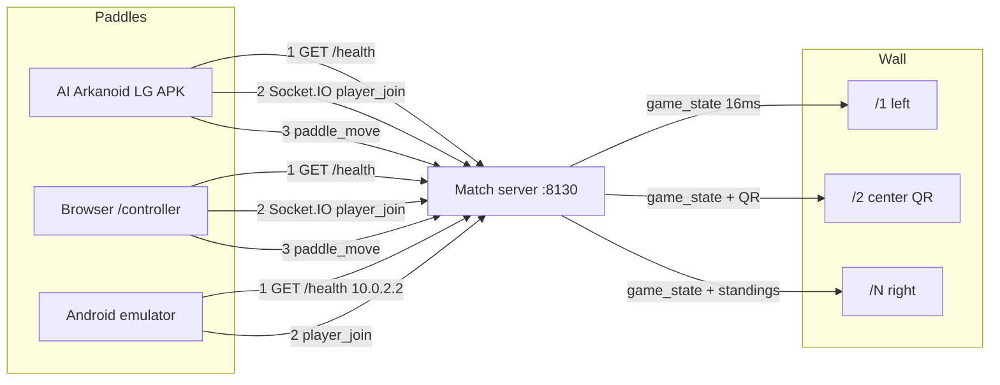
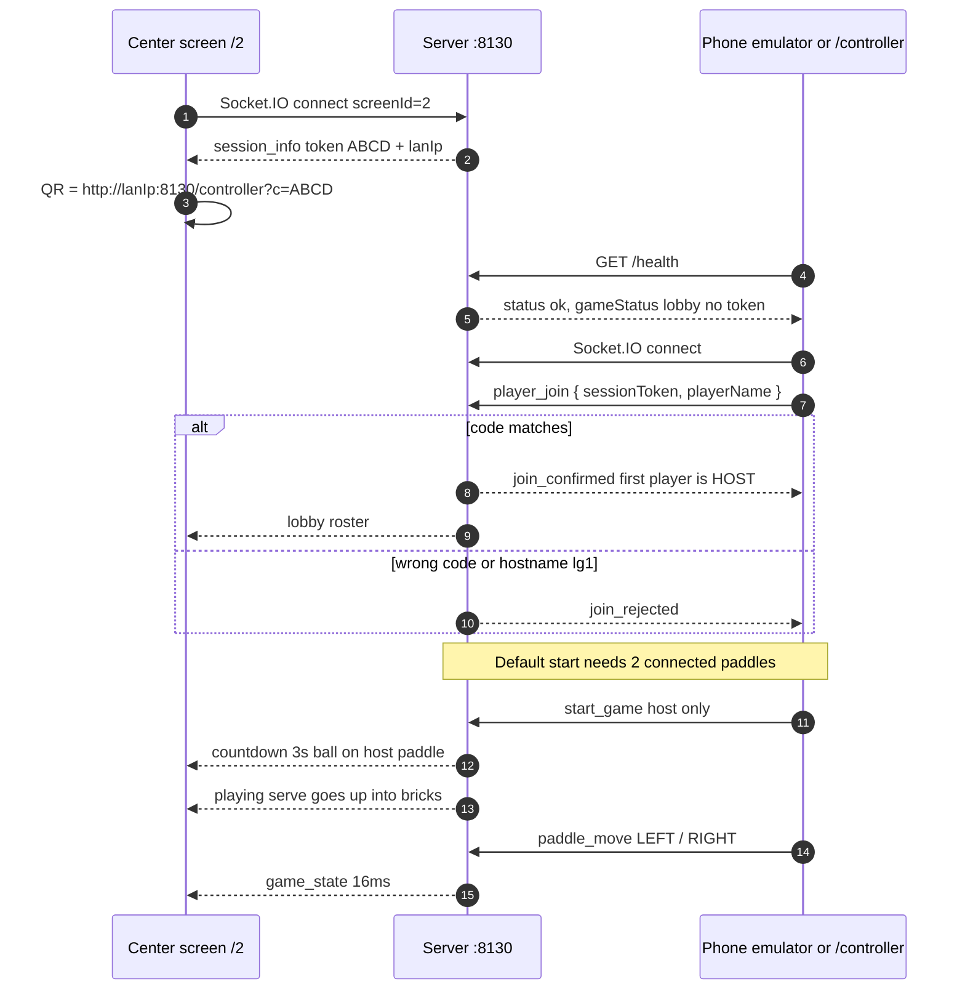
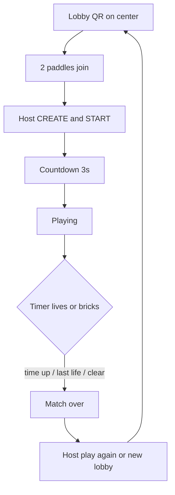
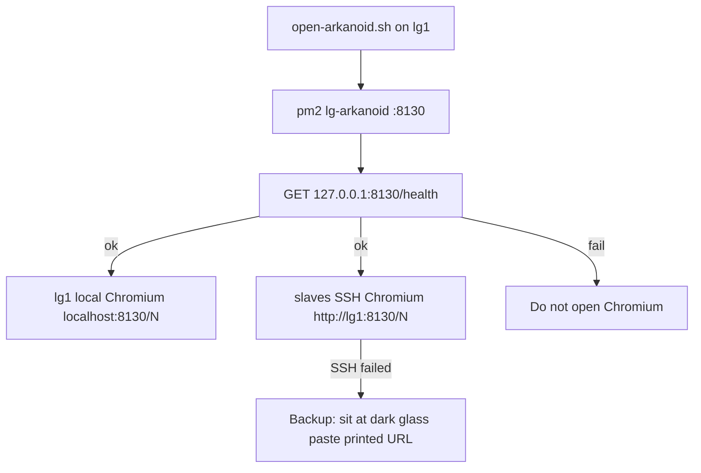

# LG Arkanoid

[](https://github.com/AnirudhPratapSinghYadav/LG-Arkanoid/actions/workflows/ci.yml)
[](LICENSE)
[](https://nodejs.org/)
[](https://flutter.dev/)

Panoramic multiplayer Arkanoid for a [Liquid Galaxy](https://www.liquidgalaxy.eu/) wall. Gemini Summer of Code 2026.

One Node process on **port 8130** is the match. Chromium on each glass draws **one slice** of that court. Phones are **paddles only**.

| | |
|---|---|
| **Contributor** | [Anirudh Pratap Singh Yadav](https://github.com/AnirudhPratapSinghYadav) |
| **Mentor** | [Sidharth Mudgil](https://github.com/SidharthMudgil) |
| **Org** | Liquid Galaxy · Gemini Summer of Code 2026 |
| **Game port** | **8130** (HTTP + Socket.IO) — join, QR, `/health`, wall, paddles |
| **SSH (rig only)** | **22** — opens Chromium. Never used to join a match. |
| **APK** | **AI Arkanoid LG** — phone controller, not the wall |

**Start here:** [A. Your computer](#a-run-on-your-computer) · [B. Phone / emulator / APK](#b-run-on-the-phone) · [C. Liquid Galaxy wall](#c-run-on-a-liquid-galaxy-wall)

Sister games on the same rig: Galaxy Pacman **8128**, Galaxy Asteroids **8129**. Do not reuse those ports.

---

## What each piece is

| Piece | Role | Not |
|---|---|---|
| `server/` (Node 16+, Express, Socket.IO) | Authoritative physics, lobby, Gemini, `/health` | Does not draw pixels |
| `web-client/` (Phaser) | Wall slices `/1`…`/N` + optional browser `/controller` | Not installed on the phone |
| `mobile/` Flutter APK | Paddle: join, lobby, D-pad + swipe, power-ups, optional SSH launch | Does **not** render bricks or the court |
| `scripts/open-arkanoid.sh` | One command on **lg1** opens Chromium on master **and** every slave | Not how phones join |

The APK and a laptop tab at `/controller` are the same role. The wall is always Chromium.

---

## How the whole game is connected

There is **one** match process. Screens subscribe as `screen-1` … `screen-N`. Controllers subscribe as paddles. `/health` is public but **never contains the join code**. The 4-letter code is pushed only to wall sockets (and already-joined paddles on rematch), then printed as a real URL under the QR:

`http://<Wi-Fi-IPv4>:8130/controller?c=ABCD`

Session codes skip `0 / O / 1 / I`. Hostname **`lg1` is blocked on phones** — they cannot resolve the cluster DNS.



SSH (port 22) is **not** in that picture. It only starts or stops Chromium on a rig. After the wall is open, every paddle still joins on **8130**.





On a **Liquid Galaxy** rig, Chromium is opened after `/health` answers:



---

## Ports (do not mix)

| What | Port | Who uses it |
|---|---|---|
| Match, QR, `/controller`, `/health`, Socket.IO | **8130** | Phones, emulators, browsers, wall Chromium |
| Launch / close the wall from the app | **22** | Settings → CONNECT LG only |

Do not type hostname **`lg1`** on a phone. Do not put the join code in `/health`. Default lobby: **2** paddles must join before START (host can set 1–5). First joiner is HOST.

Wi‑Fi blip: disconnect does **not** abort the match. Physics **freezes** while nobody is connected. Resume within **30s**. Explicit **LEAVE** aborts an empty court immediately.

---

## A. Run on your computer

Full app on one machine: wall slices in the browser + paddle in another tab (or the phone / emulator).

### A1. What you need

- Git
- **Node.js 16 or newer** (`node -v`). 18 or 20 is fine on a laptop. LG masters stay on **16.20.2**.
- Chrome / Edge / Firefox

Optional: Flutter **3.24.x** for the Android app instead of `/controller`.

### A2. Clone and install

```bash
git clone https://github.com/AnirudhPratapSinghYadav/LG-Arkanoid.git
cd LG-Arkanoid
npm install
```

### A3. Create the env file

Linux / macOS:

```bash
cp server/.env.example server/.env
```

Windows (PowerShell):

```powershell
Copy-Item server\.env.example server\.env
```

Set in `server/.env`:

```
PORT=8130
NUM_SCREENS=3
LG_PASSWORD=lq
GEMINI_API_KEY=
LG_FRAME_ASPECT=16:9
```

Leave `GEMINI_API_KEY` empty. The match still runs (arcade announcer fallback). `16:9` is for a laptop (the wall is portrait by default).

### A4. Start — this opens every slice

```bash
npm start
```

Leave this terminal open. When `/health` answers, the default browser opens **all** wall slices, not only the QR:

| Tab | URL | What it is |
|---|---|---|
| 1 | http://localhost:8130/1 | Left slice |
| 2 | http://localhost:8130/2 | Center — **QR + 4-letter code** |
| 3 | http://localhost:8130/3 | Right slice — standings in play |

That is the laptop stand-in for master + slaves. If a popup blocker eats a tab, open the missing URL from the table. `NUM_SCREENS` in `server/.env` is how many tabs you get.

```bash
curl http://127.0.0.1:8130/health
```

You want `"status":"ok"`. That JSON has **no** join code.

`http://localhost:8130/` with no path redirects to `/controller`.

```bash
npm run open-wall
```

reopens the wall tabs if the server is already running.

### A5. Open a paddle on the same computer

New tab: http://localhost:8130/controller

1. Type a name.
2. Paste the **4-letter code** from the center tab (or `?c=` in the QR URL).
3. Join. First player is **HOST**.
4. Open a **second** controller tab, different name, **same code**.
5. Host: **CREATE & START**.
6. Hold **LEFT** / **RIGHT** or swipe.

That is the whole game on one PC.

---

## B. Run on the phone

The phone is only a paddle. The match still runs on the computer (A) or on lg1 (C). **Same Wi‑Fi.** Turn off mobile data and VPN.

The emulator is the **same APK** as a real phone: QR (camera), manual join, lobby host panel, D-pad, swipe pad, power-ups, leave, Settings SSH. No features are compiled out.

### B1. Fastest: phone browser (no APK)

1. Finish section A.
2. Copy the IPv4 under the center QR (your Wi‑Fi IPv4, not `127.0.0.1`).
3. On the phone open:

   `http://<that-ipv4>:8130/controller?c=CODE`

4. Name → join. First phone is HOST.
5. A second paddle (another phone, emulator, or laptop `/controller`) joins the same code.
6. Host **CREATE & START**.

### B2. Flutter from source (device or emulator)

```bash
cd mobile
flutter pub get
flutter run
```

| Device | Join host on **8130** | SSH / LAUNCH ON RIG |
|---|---|---|
| Real phone on Wi‑Fi | IPv4 printed under the QR | Same rig IPv4, port **22** |
| Android emulator vs laptop `npm start` | **`10.0.2.2`** port **8130** | Never. `10.0.2.2` is blocked for SSH |
| USB + `adb reverse tcp:8130 tcp:8130` | `127.0.0.1` | Never |
| Emulator vs a **real lg1** on LAN | Rig Wi‑Fi IPv4, not `10.0.2.2` | Rig Wi‑Fi IPv4 |

In the app: **Scan QR** or **Manual entry** → name → join → host starts.

### B3. Install the APK

```bash
cd mobile
flutter pub get
flutter build apk --release --split-per-abi
```

Install `mobile/build/app/outputs/flutter-apk/app-arm64-v8a-release.apk` (or `armeabi-v7a` on 32-bit). App label: **AI Arkanoid LG**. Package: `com.anirudh.lg_arkanoid`. Then B2 from Scan QR.

### B4. In a match

1. Host sets players / speed / time if they want, then **CREATE & START**.
2. Countdown 3s. Ball sits on the host paddle, then launches **up** into the bricks.
3. Hold LEFT / RIGHT or swipe. 3 lives. Power-ups: wide, slow, multi, bomb.
4. TIME LEFT on every slice. Standings on the rightmost slice (hidden at match end so they do not stack).
5. LEAVE exits. Host can play again or return to lobby.

---

## C. Run on a Liquid Galaxy wall

On **lg1** only (`lg` / `lq`). Laptop testers skip this.

### C1. Install once

```bash
cd ~/projects
git clone https://github.com/AnirudhPratapSinghYadav/LG-Arkanoid.git LG-Arkanoid
cd LG-Arkanoid
bash install.sh lq
```

Installs Node **16.20.2** if needed, **pm2@5.4.3**, builds `dist/`, writes `server/.env`, opens **8130**. Vite stays **4.5.x** (Node 16 / LG glibc). Do not `npm audit fix --force`.

### C2. Open every screen (one command on master)

Galaxy Pacman and Asteroids do **not** ask you to walk to each slave. You run **one script on lg1**. That script SSHs to every other frame and starts Chromium there.

```bash
bash scripts/open-arkanoid.sh
```

Or `bash scripts/open-arkanoid.sh 5`. It starts the match on **8130**, waits for `/health`, then:

| Machine | Who opens it | URL in Chromium |
|---|---|---|
| **lg1** (master) | this script, locally on `DISPLAY=:0` | `http://localhost:8130/N` for the slice mapped to lg1 |
| **lg2, lg3, …** (slaves) | this script, over SSH from lg1 | `http://lg1:8130/N` |

Slice **N is left→right**, not Pacman’s hostname digit (`lg2` is **not** automatically `/2`).

On a 3-glass the map is usually **lg3 → /1**, **lg1 → /2 (QR)**, **lg2 → /3**. So the QR is on the **center** machine because lg1 is the center frame — not because slaves were skipped. One Chromium on lg1 looking like “only QR” is correct until slaves open.

Print the map without opening Chromium:

```bash
bash scripts/open-arkanoid.sh --frames 5
```

```bash
bash scripts/close-arkanoid.sh
```

Already cloned: `git pull` then `bash scripts/open-arkanoid.sh`.

### C2b. Backup — open Chromium by hand (when SSH fails)

This is how Pacman documents a single screen. Sit **at the dark machine**, not at a laptop across the room.

After `open-arkanoid.sh` it prints the exact lines. Example for 3 screens:

```bash
# on lg1 (center / QR)
chromium-browser --start-fullscreen 'http://localhost:8130/2'

# on lg2 (right)
chromium-browser --start-fullscreen 'http://lg1:8130/3'

# on lg3 (left)
chromium-browser --start-fullscreen 'http://lg1:8130/1'
```

On a **laptop** (no slaves) the same backup is all slices on this PC — `npm start` already opens them, or:

```
http://127.0.0.1:8130/1
http://127.0.0.1:8130/2
http://127.0.0.1:8130/3
```

Do not open `http://lg1:…` from a phone. Phones use the Wi‑Fi IPv4 and `/controller`.

Do not open `/1` `/2` `/3` **all on lg1** on a real rig. Each machine loads **one** URL.

### C3. Slaves must accept SSH

From lg1, no password prompt:

```bash
ssh -Xnf lg@lg2 'echo ok'
ssh -Xnf lg@lg3 'echo ok'
```

If that asks for a password, side screens stay dark. Fix keys, then run the open script again.

### C4. Phones on the wall

Section B, using the IPv4 **under the wall QR**, port **8130**.

Settings → CONNECT LG → LAUNCH ON RIG uses SSH **22** only to run `open-arkanoid.sh` (waits up to 180s). You still join the match on **8130**.

### C5. `server/.env` on the rig

```
PORT=8130
NUM_SCREENS=5
LG_PASSWORD=lq
GEMINI_API_KEY=
# LG_HOST_IP=10.11.77.106
```

Set `LG_HOST_IP` if the QR shows the wrong NIC. Portrait is the default. Pin landscape with `LG_FRAME_ASPECT=16:9`.

---

## Match logic (authoritative on the server)

| Event | What happens |
|---|---|
| Join | `GET /health` then Socket.IO `player_join` with the 4-letter code |
| START | Host only. Needs `maxPlayers` connected (default 2). Ball glued on host paddle |
| Countdown | 3s. Paddles can still aim. Then serve **up** into bricks |
| Play | 16 ms ticks. Bricks, power-ups, lives. Right screen shows live standings |
| Life loss | Respawn on a living connected paddle, launch up |
| Disconnect | Slot kept 30s. Court **freezes** if zero paddles connected. No immediate lobby wipe |
| LEAVE | Slot cleared. Empty court returns to lobby now |
| End | win / time_up / game_over. Host rematch or new lobby. 75s booth failsafe |
| Rematch | New session token. Wall gets `session_info`. Joined paddles get `lobby_ready` in the `controllers` room only |

---

## Gemini (ARKANOID AI)

All Gemini calls are **server-side**. The phone never ships an API key. Empty `GEMINI_API_KEY` is the normal demo path.

1. Commentary on countdown, life lost, milestones, level clear, multi-ball, rank change, victory — 10-model cascade, then arcade fallback lines.
2. Game-master JSON modifiers after a life loss (`WIDE_PADDLE` / `EXTRA_BALL` / `SLOW_BALL`).
3. Next-level brick tiles. Invalid JSON → stock `loadLevel()`.

Center Chromium speaks commentary (Web Speech). Phones TTS only `life_lost` and `victory` so the lobby is not spammed.

---

## Sounds

No `.mp3` files in the repo. Wall beeps and whistles are Web Audio oscillators. Wall TTS needs `speech-dispatcher` / `espeak-ng` on lg1 (installed by `install.sh`). Phone uses `flutter_tts` + haptics.

---

## Repo map

| Path | What |
|---|---|
| `server/index.js` | HTTP + Socket.IO boot |
| `server/routes.js` | `/health` (no token), `/controller`, `/:screenNum` |
| `server/joinUrl.js` | Join URL parse — mirrored in Flutter `join_target.dart` |
| `server/match.js` | Tick, broadcast, lobby return |
| `server/handlers/` | sockets, join/leave, start, power-ups |
| `server/engine/` | layout, collisions, physics, levels |
| `server/services/geminiClient.js` | HTTP cascade |
| `server/services/geminiService.js` | prompts + fallback |
| `web-client/public/js/` | Phaser wall, HUD, audio, controller |
| `mobile/lib/` | Flutter paddle |
| `scripts/lib/` | SSH Pacman then Asteroids sshpass, frames, health wait |
| `scripts/open-local-wall.js` | laptop `npm start` opens `/1`…`/N` on **8130** |

---

## CI and security

GitHub Actions: Node **16 / 18 / 20** `npm test` + Socket.IO e2e + `npm run build`; Flutter **3.24.3** analyze, unit tests, split-per-ABI APK; CodeQL.

Production `npm audit --omit=dev --audit-level=high` is the CI bar. Remaining Dependabot notes on **Vite 4.x** / `esbuild` / `extract-zip` are the Node-16 laptop pin (dev-only). Do not bump Vite to 5+ or pm2 to 7 on this repo. `ws` and `tar-fs` are overridden in root `package.json`.

---

## If something is wrong

| What you see | What to do |
|---|---|
| `npm start` fails | `node -v` ≥ 16. `npm install` in the repo root. |
| Tabs stay blank | Terminal still running? `curl http://127.0.0.1:8130/health` |
| Phone cannot join | Same Wi‑Fi. Port **8130**. IPv4 from the QR, not `lg1`, not 22. |
| Emulator cannot join laptop | Use **`10.0.2.2:8130`**, not `127.0.0.1` (unless `adb reverse`). |
| LAUNCH ON RIG from emulator | Must be the rig Wi‑Fi IPv4. `10.0.2.2` is rejected. |
| START does nothing | Default needs **2** paddles. Host can set slots to **1**. |
| Invalid session token | Code is 4 letters from the **center** screen. No 0/O/1/I. |
| Only lg1 has the game | From lg1: `ssh -Xnf lg@lg2 'echo ok'` then open again, or paste the printed Chromium backup line **on the dark glass**. |
| QR IP is wrong | `LG_HOST_IP=` in `server/.env`, restart. |
| Launch on Rig does nothing | Wait up to 3 minutes. `dist/` is built by `install.sh`. |
| No wall voice | HDMI muted or missing `espeak-ng`. Text still shows. |

---

## License

MIT. Copyright © Anirudh Pratap Singh Yadav · Liquid Galaxy / Gemini Summer of Code 2026.
