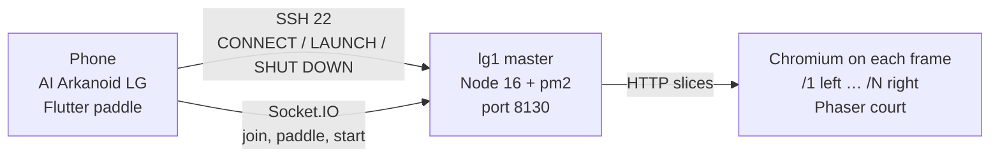
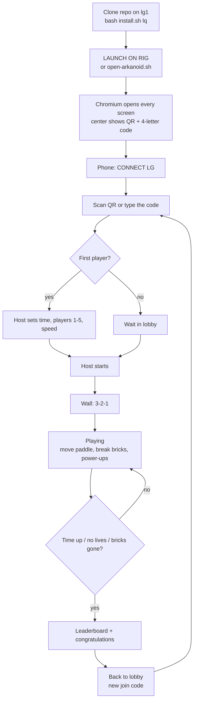

# LG Arkanoid

Panoramic multiplayer Arkanoid (brick-breaker) for a [Liquid Galaxy](https://www.liquidgalaxy.eu/) wall.

Phones are the paddles. The wall is the court. A Node.js server on the master (`lg1`) runs the match. Phaser draws one slice of that court in Chromium on each frame.

Built for **Gemini Summer of Code (GESOC / Gemini SoC) 2026** by **Liquid Galaxy**.

**Contributor:** [Anirudh Pratap Singh Yadav](https://github.com/AnirudhPratapSinghYadav)  
**Mentor:** [Sidharth Mudgil](https://github.com/SidharthMudgil)

Game port: **8130**. On the rig, use **Node 16**.

---

## How it is built

Three pieces. The phone is not the wall. The wall is not an APK.



Optional: if `GEMINI_API_KEY` is set, the server asks Gemini for spoken lines. If it is empty, the match still runs with offline lines.

---

## How a match runs



`/health` never has the join code. You cannot join during a match. After about 12 seconds the wall returns to lobby so the next game can start.

The wall is 1–12 screens (typical Liquid Galaxy: 3, 5, 7, 9, 12). At most **5** paddles. Slice `/1` is the **leftmost** physical screen.

---

## Laptop (no rig)

You do not need Liquid Galaxy to try this. Node 16, 18, or 20 is fine on a laptop. Flutter is optional if you use the browser controller.

```bash
npm install
cp server/.env.example server/.env
```

Put this in `server/.env`:

```
PORT=8130
NUM_SCREENS=3
LG_PASSWORD=lq
GEMINI_API_KEY=
LG_FRAME_ASPECT=16:9
```

`LG_FRAME_ASPECT=16:9` is for a normal monitor. Leave it empty on a real rig so the launcher follows the frames.

Then:

```bash
npm run build
npm start
```

`npm start` runs the Node server on **8130** and Vite on 5173. Rebuild after JS/CSS edits — Express serves `dist/` when it exists.

Open four tabs:

```
http://localhost:8130/1          left slice
http://localhost:8130/2          center (QR + code on a 3-screen wall)
http://localhost:8130/3          right slice
http://localhost:8130/controller paddle stand-in
```

The first `/controller` tab to join is the host. Create the game and start.

---

## Liquid Galaxy rig

The master is Ubuntu 16.04. Node **16** is required there (`.nvmrc` is `16.20.2`). Newer Node will not start on that glibc.

SSH as user **`lg`**. The password is whatever you pass to `install.sh` — **`lq`** on a typical stock rig.

On `lg1`:

```bash
node -v                          # must be v16.x
cd ~/projects
git clone https://github.com/AnirudhPratapSinghYadav/LG-Arkanoid.git LG-Arkanoid
cd LG-Arkanoid
bash install.sh lq
bash scripts/open-arkanoid.sh 3  # or 5 / 12, or omit to use the rig's screen count
```

`install.sh lq` installs Node 16 if needed, pm2, npm packages, builds the wall client, writes `server/.env` (`PORT=8130`, password, screen count from the rig), and opens port **8130**.

`open-arkanoid.sh` starts the Node process with pm2 and opens Chromium on every frame:

- Master (`lg1`) opens `http://localhost:8130/<slice>`
- Other frames open `http://lg1:8130/<slice>`

`/1` is leftmost. On a 3-screen wall the center is `/2`. On a 5-screen wall the center is `/3`.

Useful extras:

```bash
bash scripts/open-arkanoid.sh --frames 3   # print the slice map, launch nothing
bash scripts/close-arkanoid.sh             # stop this game only
```

The phone **LAUNCH ON RIG** button runs `open-arkanoid.sh` over SSH. You do not start the match from the wall.

---

## Phone

Stay on the same Wi-Fi as `lg1`.

The phone launcher is labelled **AI Arkanoid LG**. Settings are:

| Field | Typical value |
|---|---|
| Username | `lg` |
| Password | `lq` (same as `install.sh`) |
| IP | IPv4 of `lg1` |
| Port | `22` (SSH, not the game port) |
| Number of screens | 3 / 5 / 7 / … or what the rig reports |

Then:

1. **CONNECT LG**
2. **LAUNCH ON RIG**
3. Scan the wall QR (`LGARK|ip|8130|code`) or type the 4-letter code
4. Host sets time (1 / 3 / 5 min / endless), players (1–5), speed (slow / medium / fast / insane)
5. Host starts

**SHUT DOWN ON RIG** runs `close-arkanoid.sh`.

No APK? Open `http://<master-ip>:8130/controller` on the phone.

To build the controller yourself:

```bash
cd mobile
flutter pub get
flutter build apk --release
```

CI pins Flutter **3.24.3**.

---

## How to play

Swipe or drag on the phone to move your paddle. Catch the ball, break bricks, grab power-ups (wide paddle, slow ball, extra balls, bomb).

Each player starts with **3 lives**. Timed matches show **TIME LEFT** on every screen. Live standings sit on the rightmost screen. When time runs out, lives run out, or the bricks are cleared, the wall and phones show the **final leaderboard**.

---

## Gemini commentary (optional)

If `GEMINI_API_KEY` is set in `server/.env`, the wall can speak ARKANOID AI lines during play.

Leave the key empty and the game uses its own offline lines. That is the default. A missing or bad key does not break the match.

---

## Tests

```bash
npm test
npm run build
node server/tests/e2e-multi-client.test.js
```

`npm test` is the game-engine unit tests. The e2e script wants the server already listening on 8130.

---

## More docs

Setup, play, and store notes are all in this README. Phone controller extras: [mobile/README.md](mobile/README.md).

---

## License

MIT. Copyright © Anirudh Pratap Singh Yadav · Liquid Galaxy / Gemini Summer of Code 2026.
