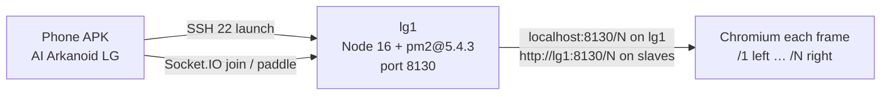

# LG Arkanoid

Panoramic multiplayer Arkanoid for a [Liquid Galaxy](https://www.liquidgalaxy.eu/) wall.

Phones are the paddles. The wall is the court. Node on **lg1** is the match. Chromium on each frame draws one slice.

**Contributor:** [Anirudh Pratap Singh Yadav](https://github.com/AnirudhPratapSinghYadav)  
**Mentor:** [Sidharth Mudgil](https://github.com/SidharthMudgil)  
**Org:** Liquid Galaxy · Gemini Summer of Code 2026

---

## Versions (do not mix)

| Piece | Version | Why |
|---|---|---|
| Game port | **8130** | Pacman 8128, Asteroids 8129, pong 8112, snake 8114, LGRG 3123 |
| Node on the **rig** | **16.20.2** (`.nvmrc`) | Ubuntu 16.04 / glibc 2.23. Node 18 will not run there |
| pm2 on the rig | **5.4.3** | pm2 7 needs Node 18 (`EBADENGINE` on a Lleida log) |
| Helmet | **7.x** | Helmet 8 needs Node 18 |
| Vite | **4.x** | Vite 5 needs Node 18 |
| Flutter (APK / CI) | **3.24.3** | Pinned in GitHub Actions |
| Phaser | **3.80** vendored | No CDN on an offline rig LAN |

On a **laptop** Node 16, 18, or 20 is fine. On **lg1**, only 16.

Do **not** `npm install -g pm2` (pulls 7). Do **not** `npm audit fix --force` (that was the “1 high severity vulnerability” after pm2 7 installed; force-upgrade breaks Node 16).

---

## How it is built



Optional `GEMINI_API_KEY` in `server/.env`. Empty key = offline lines. Match still runs.

`/health` never contains the join code. `/1` is the **leftmost** physical screen. Max **5** paddles. 1–12 frames.

---

## Liquid Galaxy rig — copy this in order

SSH as user **`lg`**. Stock password is **`lq`**.

### 0. Prove SSH the way Pacman does

Published Pacman (`galaxy-pacman/Bash/open-pacman.sh`) opens **every** frame, including lg1, with:

```bash
ssh -Xnf lg@$lg " export DISPLAY=:0 ; chromium-browser <url> --start-fullscreen … &"
```

Published Asteroids (`galaxy-asteroids/scripts/open.sh`) opens **lg1 Chromium locally** on `DISPLAY=:0` (no ssh to self) and **slaves** with:

```bash
sshpass -p $PW ssh -tXn $lg "export DISPLAY=:0 ; chromium-browser <url> --start-fullscreen &" &
```

This repo matches that split. **Master (lg1):** local Chromium like Asteroids. **Slaves:** Pacman `ssh -Xnf lg@host` first, then Asteroids `sshpass` + `ssh -tXn lg@host` in the background. Always `lg@` — without it, ssh uses the operator user and the glass stays dark. Do **not** timeout-kill the Asteroids ssh (that SIGHUPs slave Chromium). Slice URLs stay `/1` left … `/N` right (not Pacman’s `${lg:2}` hostname digit).

Open does **not** run `npm run build`. `install.sh` already built `dist/`. A phone SSH used to die at 45s while Vite rebuilt, so master+slaves never opened.

From **lg1**:

```bash
node -v
# must print v16.x   (v16.20.2 on a typical Lleida image)

ssh -Xnf lg@lg2 'echo ok'
ssh -Xnf lg@lg3 'echo ok'
# If this asks for a password, no LG game can open slaves.
# Fix liquid-galaxy SSH keys first. Do not invent extra ssh -i flags.
```

Chromium must exist on **every** frame (`chromium-browser --version`). Pacman assumes that.

### 1. Install

```bash
cd ~/projects
git clone https://github.com/AnirudhPratapSinghYadav/LG-Arkanoid.git LG-Arkanoid
cd LG-Arkanoid
bash install.sh lq
```

`install.sh lq` installs Node 16 if needed, **pm2@5.4.3**, npm packages, builds `dist/`, writes `server/.env`, opens **8130** in iptables/ufw when those files exist.

Already cloned from an older install that pulled pm2 7:

```bash
source ~/.nvm/nvm.sh
nvm use 16
npm install -g pm2@5.4.3
cd ~/projects/LG-Arkanoid
git pull
bash scripts/open-arkanoid.sh
```

### 2. Files that must exist on the rig after install

```
~/projects/LG-Arkanoid/server/index.js
~/projects/LG-Arkanoid/server/.env          # created by install.sh — never commit
~/projects/LG-Arkanoid/scripts/open-arkanoid.sh
~/projects/LG-Arkanoid/scripts/close-arkanoid.sh
~/projects/LG-Arkanoid/scripts/lib/*.sh
~/projects/LG-Arkanoid/dist/index.html      # wall client; built once by install.sh (not on each open)
```

`server/.env` (install writes this; pin Wi‑Fi IPv4 if the QR is wrong):

```
PORT=8130
NUM_SCREENS=5
LG_PASSWORD=lq
GEMINI_API_KEY=
# LG_HOST_IP=10.11.77.106
```

Phone **LAUNCH ON RIG** always runs:

```bash
bash ~/projects/LG-Arkanoid/scripts/open-arkanoid.sh
```

If the checkout lives somewhere else, `install.sh` symlinks that path.

### 3. Open the wall

```bash
bash scripts/open-arkanoid.sh 5
# omit the number to use DHCP_LG_FRAMES_MAX from /lg/personavars.txt
bash scripts/open-arkanoid.sh --frames 5   # print L→R map, open nothing
bash scripts/close-arkanoid.sh
```

What the open script does:

1. Start/restart `lg-arkanoid` with pm2 on **8130**. Does **not** rebuild Vite.
2. Wait until `http://127.0.0.1:8130/health` answers.
3. **lg1:** local Chromium on `DISPLAY=:0` → `http://localhost:8130/N` (Asteroids).
4. **Each slave:** Pacman `ssh -Xnf lg@$frame " export DISPLAY=:0 ; chromium-browser http://lg1:8130/N --start-fullscreen … &"`  
   (`N` is left→right. Pacman uses `${lg:2}` from the hostname. Do not copy that here — this is one court.)
5. If Pacman SSH fails on a slave: Asteroids `sshpass` + `ssh -tXn lg@$frame` (backgrounded, never timeout-killed).

If a slave stays dark, the log prints `Warning: failed to open Chromium on lgN` and the exact `ssh -Xnf lg@lgN 'echo ok'` check, then **exit 1**. Chromium is not opened at all if `http://127.0.0.1:8130/health` does not answer (20s wait). `Launched N screens` with **exit 0** means every frame opened **and** the match process was healthy.

The phone **LAUNCH ON RIG** waits up to **180s** for that script (it used to abort at 45s).

LGRG (lg-retro-gaming) calls `bash open-arkanoid.sh lq` — the first argument is the rig password, same as Asteroids/Pacman installers.

---

## Phone — connecting screen (practical)

1. Install the **AI Arkanoid LG** APK (not an old build that only understood `LGARK|…` payloads).
2. Join the **same Wi-Fi as lg1**. Turn off mobile data and VPN.
3. Open the app → **Scan QR** on the **center** screen (or paste the URL printed under the QR).
4. Enter a name. The next screen shows the exact wall URL + code before it tries.
5. **JOINING THE WALL** then does, in order:
   - `GET http://<ipv4>:8130/health` (several tries — first Wi‑Fi packet is slow)
   - the body must be this game (`status: ok` + `gameStatus`) — a random HTTP 200 on 8130 is rejected
   - Socket.IO to the same host:port
   - send the 4-letter code + name
   - **CANCEL** drops the attempt immediately (Android back does the same)
6. First phone in is HOST. They start the match.
7. Hold **LEFT** / **RIGHT**. There is no touch pad.

The QR is `http://<lg1-ipv4>:8130/controller?c=CODE`. The APK reads it. A camera / Chrome can open the same link (that is how Pacman joins: `masterIp:port/controller`).

`http://<ipv4>:8130/` with no path redirects to `/controller`.

Do not type hostname **`lg1`**. Phones cannot resolve it. The app blocks it.

**127.0.0.1 / localhost** is only for USB debugging:

```bash
adb reverse tcp:8130 tcp:8130
```

**CONNECT LG** (settings) is only to launch/stop the wall from the phone. SSH port is **22**. Game join port is **8130**. Mixing them is the usual “correct link did nothing” mistake.

**Leave at any time:** the connecting screen has **CANCEL**. The lobby has **LEAVE LOBBY**. During a match the phone shows a red **LEAVE** label (not a tiny icon) and the web paddle shows a red **LEAVE** in the HUD. Android back asks before dropping the session. After a match, **NEXT LOBBY** waits for the wall; **LEAVE** still exits immediately.

| Settings field | Typical |
|---|---|
| Username | `lg` |
| Password | `lq` |
| IP | IPv4 of lg1 |
| SSH port | `22` |
| Screens | 3 / 5 / 7 / … |

If the printed IPv4 is the wrong NIC, set `LG_HOST_IP=` in `server/.env` and relaunch.

Build the APK (Flutter **3.24.3**):

```bash
cd mobile
flutter pub get
flutter build apk --release --split-per-abi
```

Install `app-armeabi-v7a-release.apk` on 32-bit phones, `app-arm64-v8a-release.apk` on everything modern. Do not install an older APK that only understood `LGARK|…` payloads.

---

## Laptop (no rig)

```bash
npm install
cp server/.env.example server/.env
```

In `server/.env`:

```
PORT=8130
NUM_SCREENS=3
LG_PASSWORD=lq
GEMINI_API_KEY=
LG_FRAME_ASPECT=16:9
```

```bash
npm run build
npm start
```

```
http://localhost:8130/1
http://localhost:8130/2          QR on a 3-screen layout
http://localhost:8130/3
http://localhost:8130/controller
```

---

## How to play

Hold LEFT / RIGHT. 3 lives. Power-ups: wide, slow, multi, bomb. Timed matches show TIME LEFT. Standings on the rightmost screen.

---

## Tests / CI

```bash
npm test
npm run build
node server/tests/e2e-multi-client.test.js   # server already on 8130
```

GitHub Actions: Node 16 + 18 + 20 (`npm test`, production `npm audit --audit-level=high`, Socket.IO e2e, Vite build) and Flutter 3.24.3 analyze + APK.

Dependabot: weekly npm + Actions + Dart, with Helmet 8+, Vite 5+, pm2 6+, Express 5+, node-fetch 3+, concurrently 9+, express-rate-limit 8+, puppeteer-core 22+, setup-java 5+, flutter_lints 6+, and flutter_secure_storage 11+ ignored so the rig stays on Node 16 (`pm2@5.4.3`).

Do not `npm audit fix --force` on the rig.

---

## Troubleshooting (Lleida / Andreu screenshots)

**Only lg1 showed the game; slaves stayed dark**  
`ssh -Xnf lg@lg2 'echo ok'` must work with no password. That is Pacman. Extra `ssh -i` keys without `IdentitiesOnly` hit MaxAuthTries. This launcher uses Pacman’s command first.

**`pm2@7.0.3` / `EBADENGINE` / Node >=18 / “1 high severity vulnerability”**  
Unpinned `npm i -g pm2` on Node 16.20.2. Fix: `npm i -g pm2@5.4.3`. Never `npm audit fix --force`. `PM2 is not managing any process, skipping save` after install is normal until the first `open-arkanoid.sh`.

**QR / “correct link” on the phone**  
Same Wi-Fi. Latest APK. URL under the QR (`http://IPv4:8130/controller?c=CODE`). Port **8130**. Not `lg1`. Not port 22. The connecting screen prints the URL it is probing. Codes skip 0/O/1/I so they are not misread (OWGO vs OGWO). Android emulator join: `10.0.2.2:8130`. SSH/launch from the emulator still needs the rig’s Wi‑Fi IPv4.

**LAUNCH ON RIG did nothing / wall stayed dark**  
The phone used to kill SSH at 45s while `open-arkanoid.sh` ran `npm run build`. Launch no longer rebuilds, and the app waits 180s. `dist/` is built by `install.sh`. Master Chromium is local on lg1; slaves need `ssh -Xnf lg@lg2 'echo ok'`.

**TOUCH pad / vibrating splash**  
TOUCH is removed. D-PAD only. Splash is ~900 ms.

**Double logos on the leftmost screen**  
HTML corner mark only; Phaser logos stay hidden on `/1`.

**Lobby overflow on short frames**  
Lobby card shrinks. Controller D-PAD fills leftover height.

---

## License

MIT. Copyright © Anirudh Pratap Singh Yadav · Liquid Galaxy / Gemini Summer of Code 2026.
