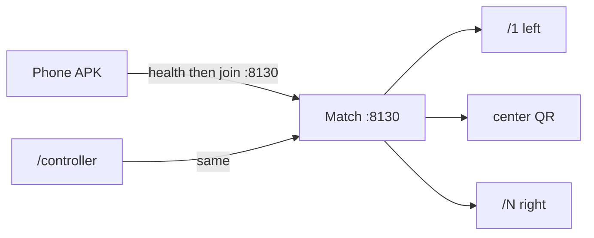

# LG Arkanoid

[](https://github.com/AnirudhPratapSinghYadav/LG-Arkanoid/actions/workflows/ci.yml)
[](LICENSE)

Panoramic multiplayer Arkanoid for a [Liquid Galaxy](https://www.liquidgalaxy.eu/) wall. Liquid Galaxy · GESOC 2026.

Phones are **paddles only**. Chromium on each glass draws one slice. One Node process on **port 8130** is the match.

**Download the phone APK:** [27-08-2026-v2-AnirudhPratapSinghYadav-Arkanoid_AI-GESOC2026.apk](https://github.com/AnirudhPratapSinghYadav/LG-Arkanoid/releases/latest/download/27-08-2026-v2-AnirudhPratapSinghYadav-Arkanoid_AI-GESOC2026.apk)

Same build as [LG_Arkanoid_1.0.0.apk](https://github.com/AnirudhPratapSinghYadav/LG-Arkanoid/releases/latest/download/LG_Arkanoid_1.0.0.apk) (GO Store filename). Release APK, under 50 MB. Listing kit: [`store/LG_Arkanoid/`](store/LG_Arkanoid/).

| | |
|---|---|
| **Contributor** | [Anirudh Pratap Singh Yadav](https://github.com/AnirudhPratapSinghYadav) |
| **Mentor** | [Sidharth Mudgil](https://github.com/SidharthMudgil) |
| **Game port** | **8130** — join, QR, `/health`, wall, paddles |
| **SSH (rig only)** | **22** — opens Chromium on every glass from lg1 |

**Start here:** [A. Computer](#a-run-on-your-computer) · [B. Phone](#b-run-on-the-phone) · [C. Liquid Galaxy wall](#c-run-on-a-liquid-galaxy-wall)

---

## How it connects

One match. Wall slices are `/1` left … `/N` right. The 4-letter code is on the **center** screen, never in `/health`. QR:

`http://<Wi-Fi-IPv4>:8130/controller?c=ABCD`

Do not type hostname **`lg1`** on a phone. First joiner is HOST. Host can **START WITH 1**.



On a rig, one command on **lg1** SSHs every slave after `/health` answers. SSH is not how you join a match.

---

## A. Run on your computer

Node **16+**. Laptop: set `LG_FRAME_ASPECT=16:9`.

```bash
git clone https://github.com/AnirudhPratapSinghYadav/LG-Arkanoid.git
cd LG-Arkanoid
npm install
```

Linux/macOS: `cp server/.env.example server/.env`  
Windows: `Copy-Item server\.env.example server\.env`

```
PORT=8130
NUM_SCREENS=3
LG_PASSWORD=lq
LG_FRAME_ASPECT=16:9
```

```bash
npm start
```

Opens every slice on **8130** (not only the QR):

| Tab | URL |
|---|---|
| Left | http://localhost:8130/1 |
| Center QR | http://localhost:8130/2  *(3 screens; on 5 glasses this is `/3`)* |
| Right | http://localhost:8130/3 |

Paddle tab: http://localhost:8130/controller — name, 4-letter code, join. Host **START**. If a popup blocker eats a tab: `npm run open-wall`.

---

## B. Run on the phone

Same Wi‑Fi as the computer or lg1. Turn off mobile data and VPN.

**APK:** [download](https://github.com/AnirudhPratapSinghYadav/LG-Arkanoid/releases/latest/download/27-08-2026-v2-AnirudhPratapSinghYadav-Arkanoid_AI-GESOC2026.apk)

Or skip the APK and open `http://<QR-IPv4>:8130/controller?c=CODE` in the phone browser.

| Device | Join on **8130** |
|---|---|
| Real phone | IPv4 under the wall QR |
| Android emulator vs laptop | `10.0.2.2` |
| Emulator vs a real lg1 | Rig Wi‑Fi IPv4, never `10.0.2.2` |

Scan QR or type the code. Host START. Hold LEFT / RIGHT or swipe.

Settings → CONNECT LG / LAUNCH ON RIG uses SSH **22** only to open the wall. Join is still **8130**. Never `lg1` or `10.0.2.2` for SSH.

---

## C. Run on a Liquid Galaxy wall

On **lg1** (`lg` / `lq`). First time:

```bash
mkdir -p ~/projects
cd ~/projects
git clone https://github.com/AnirudhPratapSinghYadav/LG-Arkanoid.git LG-Arkanoid
cd LG-Arkanoid
bash install.sh lq
bash scripts/open-arkanoid.sh
```

Already cloned (this is the pull testers should run):

```bash
cd ~/projects/LG-Arkanoid
git fetch origin
git checkout main
git pull --ff-only origin main
bash install.sh lq
bash scripts/open-arkanoid.sh
```

`install.sh` also `git pull`s. Open with no number uses the rig's screen count from `personavars.txt` (or `NUM_SCREENS` in `server/.env`). To force a count: `bash scripts/open-arkanoid.sh 5` (also 7, 9, 12). `--frames 5` is the same launch, not a dry run. Map only: `bash scripts/open-arkanoid.sh --map`.

**One master: lg1.** It loads the center QR slice `ceil(N/2)`. Slaves open `http://lg1:8130/N`.

| Glasses | Left → right | lg1 / QR |
|---|---|---|
| 3 | lg3 lg1 lg2 | `/2` |
| 5 | lg4 lg5 lg1 lg2 lg3 | `/3` |
| 7 | lg5 lg6 lg7 lg1 … lg4 | `/4` |
| 9 | lg6…lg9 lg1 … lg5 | `/5` |
| 12 | lg8…lg12 lg1 … lg7 | `/6` |

Looking only at lg1 and seeing the QR is correct. Side screens are other machines. After open, the script prints one Chromium line per glass. If a glass stays dark, sit **at that machine** and paste its line. The open script now checks that Chromium is running on each slave before it reports success.

3-screen paste (sit at that PC):

```bash
# lg3 (left)     chromium-browser --start-fullscreen 'http://lg1:8130/1'
# lg1 (QR)       chromium-browser --start-fullscreen 'http://localhost:8130/2'
# lg2 (right)    chromium-browser --start-fullscreen 'http://lg1:8130/3'
```

```bash
bash scripts/close-arkanoid.sh
ssh -Xnf lg@lg2 'echo ok'
```

`server/.env` on the rig: `PORT=8130`, `NUM_SCREENS=5` (or your count). Set `LG_HOST_IP=` if the QR IP is wrong.

---

## If something is wrong

| What you see | What to do |
|---|---|
| `npm start` fails | `node -v` ≥ 16. `npm install` in the repo root |
| Phone cannot join | Same Wi‑Fi. Port **8130**. IPv4 from the QR, not `lg1`, not 22 |
| Emulator vs laptop | `10.0.2.2:8130` |
| START looks dead | Tap **START WITH 1** — one paddle is enough |
| Invalid session token | 4 letters from the **center** QR slice |
| Only lg1 has the game | `ssh -Xnf lg@lg2 'echo ok'` then open again, or paste the printed Chromium line on the dark glass |
| QR IP is wrong | `LG_HOST_IP=` in `server/.env`, restart |

---

## License

MIT. Copyright © Anirudh Pratap Singh Yadav · Liquid Galaxy / GESOC 2026.
