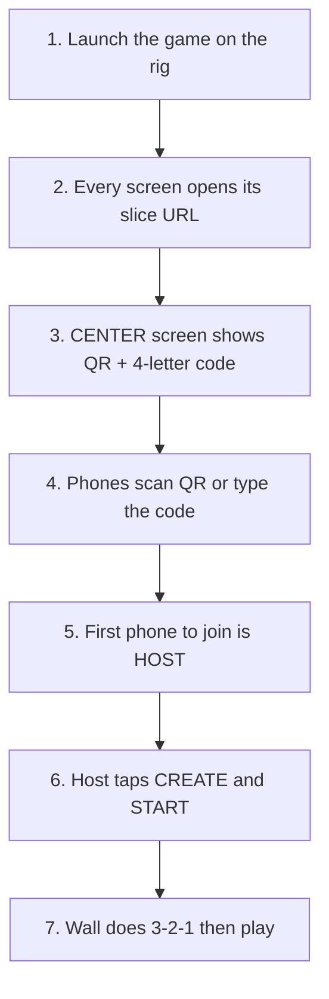
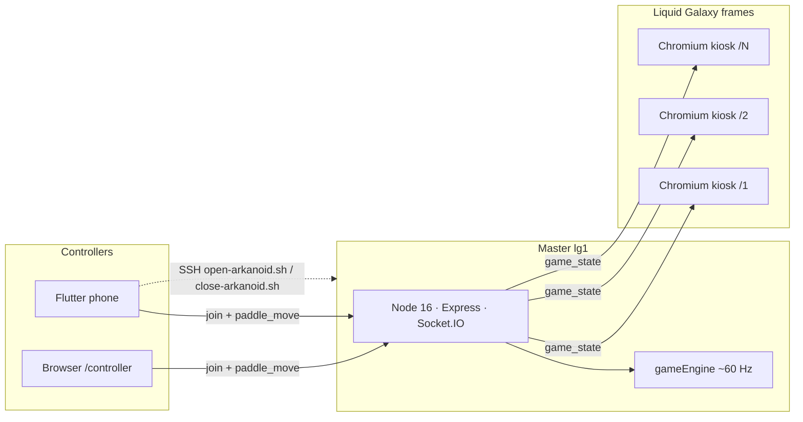
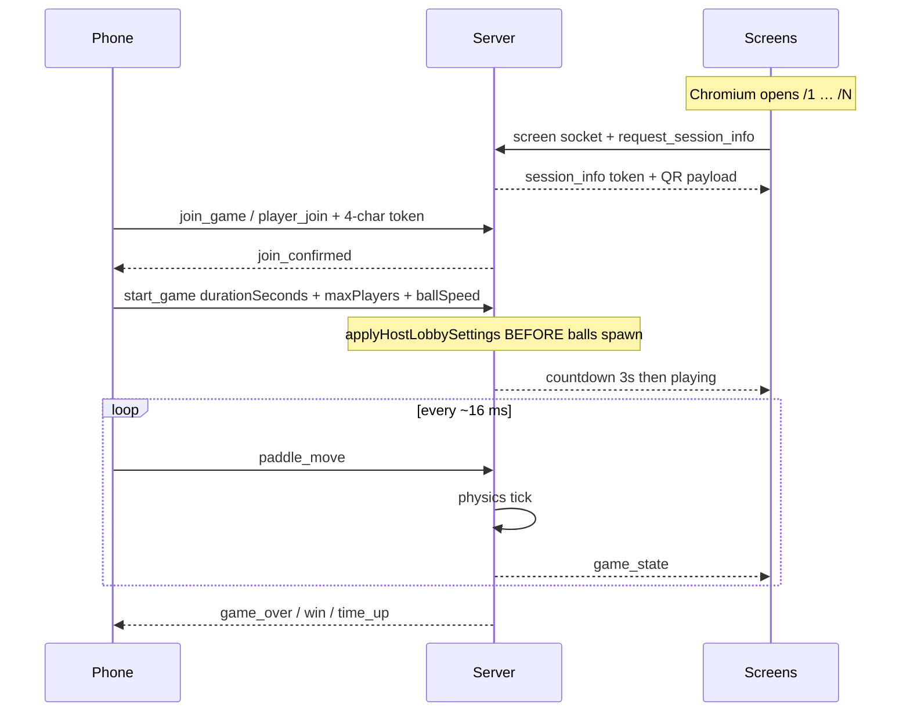
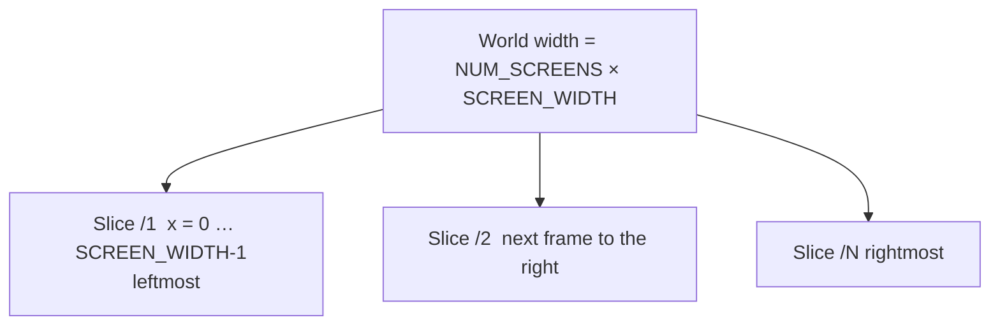

# 🕹️ LG Arkanoid

[](https://github.com/AnirudhPratapSinghYadav/LG-Arkanoid/actions/workflows/ci.yml)
[](#license)
[](#supported-versions)
[](#supported-versions)
[](#port-allocation)

**Panoramic multiplayer Arkanoid for [Liquid Galaxy](https://www.liquidgalaxy.eu/).**  
Phones are the controllers. The Liquid Galaxy wall is the game screen.

Built for **Gemini Summer of Code 2026** · Liquid Galaxy Lab

| | |
|---|---|
| **Author** | [Anirudh Pratap Singh Yadav](https://github.com/AnirudhPratapSinghYadav) |
| **Contributor** | [Sidharth Mudgil](https://github.com/SidharthMudgil) |
| **Repository** | https://github.com/AnirudhPratapSinghYadav/LG-Arkanoid |
| **Game port** | **8130** |

This follows the same deploy pattern as [galaxy-pacman](https://github.com/LiquidGalaxyLAB/galaxy-pacman): **Node + pm2 on the master, Chromium kiosk on every frame, no Docker.**

---

## What is this?

LG Arkanoid turns a Liquid Galaxy rig into one continuous brick-breaker. The ball and bricks span **3, 5, 7, 9, or 12** physical screens stitched into a single virtual court.

Players join with Android phones (Flutter APK) or any browser at `/controller`. The phone never renders the level — it only sends paddle input. Physics, scoring, lives, levels, and power-ups run on an authoritative Node.js server on the master (`lg1`). Each screen opens Chromium in kiosk mode and draws only its slice of the world.

Frame width follows the rig's own rotation (`DHCP_RANDR` / `LG_FRAME_ASPECT`): stock portrait 1080×1920 frames get a **608-wide** court; unrotated landscape frames stay **1920×1080**.

---

## Features

- Authoritative server physics (~60 Hz)
- Multi-screen ball handoff across bezels
- 1–5 players · Flutter phone + optional browser controller
- Lobby, 3-second countdown, timed (60–600 s) or endless matches
- Power-ups: wide paddle, slow ball, multi-ball, bomb
- QR join (`LGARK|ip|port|token`) — the 4-character code is **never** on `/health`
- SSH launch / close from the phone (same fields as sister LG apps)
- Optional **ARKANOID AI** (Gemini): ten-model cascade, then spoken arcade lines when the key is empty or all models fail
- Host **Create game**: match time, ball speed, players (= wall screens, max 5)
- **TIME LEFT** countdown on **every** wall slice (not only the center)
- Match HUD: logos hide when the whistle blows; live standings + lives on the **rightmost** screen; ARKANOID AI commentary slides in **below the bricks** on the center screen
- After the match: **CONGRATULATIONS**, one-line message, and **FINAL LEADERBOARD** on the wall + phones
- Screen counts **1–12** (typical LG: 3 / 5 / 7 / 9 / 12)
- Registers with **lg-retro-gaming** when that launcher is present

---

## Table of contents

1. [Commands before you open the game](#commands-before-you-open-the-game)
2. [Supported versions](#supported-versions)
3. [Before running (Liquid Galaxy)](#before-running-liquid-galaxy)
4. [Install and launch on the rig](#install-and-launch-on-the-rig)
5. [How a match starts](#how-a-match-starts)
6. [Connect players](#connect-players)
7. [Run locally (no rig)](#run-locally-no-rig)
8. [How it works](#how-it-works)
9. [Repository layout](#repository-layout)
10. [Environment](#environment)
11. [Documentation](#documentation)
12. [Contributors](#contributors)
13. [License](#license)

---

## Commands before you open the game

Paste these **before** Chromium or `npm start`. Nothing on the wall will show a QR until the server is up.

### Laptop / virtual rig (Windows, macOS, Linux)

```bash
node -v                          # 16, 18, or 20  (rig itself must be 16)
npm install
cp server/.env.example server/.env
```

Put this in `server/.env`:

```
PORT=8130
NUM_SCREENS=3
LG_PASSWORD=lq
GEMINI_API_KEY=
LG_FRAME_ASPECT=16:9
```

Then:

```bash
npm run build                    # Express serves dist/ if it exists — always rebuild after JS/CSS edits
npm start                        # Node server 8130 + Vite 5173
```

Open **four** browser windows:

```
http://localhost:8130/1          # left slice
http://localhost:8130/2          # CENTER — QR + 4-letter code (3-screen wall)
http://localhost:8130/3          # right slice
http://localhost:8130/controller # phone stand-in
```

First `/controller` tab to join is **HOST** → **CREATE & START**.

### Liquid Galaxy master (`lg1`, user `lg`)

```bash
node -v                          # must be v16.x
cd ~/projects
git clone https://github.com/AnirudhPratapSinghYadav/LG-Arkanoid.git LG-Arkanoid
cd LG-Arkanoid
bash install.sh lq               # Node 16, pm2, npm install, npm run build, iptables 8130
bash scripts/open-arkanoid.sh 3  # or 5 / 12 / omit to use DHCP_LG_FRAMES_MAX
```

The phone app **LAUNCH ON RIG** runs that last script over SSH. You do not click Start on the wall.

---

## Supported versions

Pin these. The LAB master is still **Ubuntu 16.04 / glibc 2.23**. Node 18+ will not start (`GLIBC_2.27 not found`).

| Piece | Version | Why |
|-------|---------|-----|
| **Ubuntu on `lg1`** | 16.04 LTS | Stock Liquid Galaxy image |
| **Node.js on the rig** | **16** (`.nvmrc` = `16.20.2`) | Last Node that runs on glibc 2.23 |
| **Node.js on a laptop / CI** | 16, 18, or 20 | CI matrix in `.github/workflows/ci.yml` |
| **npm** | ships with Node | |
| **pm2** | latest via `npm i -g pm2` | Keeps the server alive on `lg1` |
| **Chromium** | `chromium-browser` (Ubuntu 16) or `chromium` / `google-chrome` | Kiosk wall client |
| **Express** | 4.21.x | HTTP + static screens |
| **Socket.IO** | 4.8.x | Phone + wall transport |
| **Helmet** | **7.2.0** | Helmet 8 needs Node 18 — would crash the rig |
| **express-rate-limit** | 7.5.x | Node 16 compatible |
| **Phaser** | **3.80** (vendored, no CDN) | Works on an offline rig LAN |
| **Vite** | **4.5.x only** | Vite 5+ needs newer Node |
| **Flutter** | **3.24.3** (CI pin) | Dart SDK `>=3.0.0 <4.0.0` |
| **Android minSdk** | 21 (Android **5.0+**) | Store field `android_OS`: `"5.0+"` |
| **applicationId** | `com.anirudh.lg_arkanoid` | |
| **App / game version** | **1.0.0** | |
| **Game port** | **8130** | Next free LG game slot |
| **SSH** | 22 · user `lg` · password `lq` on stock rigs | |
| **Screens** | 1–12 | Typical: 3, 5, 7, 9, 12 |
| **ARKANOID AI** | Gemini **10-model cascade** then arcade TTS | Empty `GEMINI_API_KEY` = offline announcer. Bad keys cool down (no 16 ms flood). |

Sister games for comparison:

| Game | Node they document | Port | Wall client |
|------|--------------------|------|-------------|
| [galaxy-pacman](https://github.com/LiquidGalaxyLAB/galaxy-pacman) | 14 | 8128 | Chromium `--start-fullscreen` |
| [galaxy-asteroids](https://github.com/LiquidGalaxyLAB/galaxy-asteroids) | — | 8129 | Chromium `--start-fullscreen` |
| [lg-rpg](https://github.com/LiquidGalaxyLAB/lg-rpg) | **16** | 8111 | Phaser 4 from a CDN |
| **LG Arkanoid** | **16** | **8130** | Phaser 3.80 **vendored** + `--kiosk` |

**Do not Dockerize for LAB demos.** Mentors expect native pm2 + Chromium, the same as Pacman.

---

## Before running (Liquid Galaxy)

Copy this checklist on `lg1`. It matches [galaxy-pacman](https://github.com/LiquidGalaxyLAB/galaxy-pacman)'s "Before Running" section, with the versions this project actually needs.

1. Liquid Galaxy **core** is installed. See [liquid-galaxy](https://github.com/LiquidGalaxyLAB/liquid-galaxy).
2. **Node.js 16** is on the master:

```bash
node -v
```

The output must look like `v16.20.2`. If it is missing or is 18+, install with nvm:

```bash
curl -o- https://raw.githubusercontent.com/nvm-sh/nvm/v0.39.7/install.sh | bash
export NVM_DIR="$HOME/.nvm"
. "$NVM_DIR/nvm.sh"
nvm install 16
nvm alias default 16
nvm use 16
node -v
```

3. Install **pm2** on the master:

```bash
npm i -g pm2
```

(`install.sh` also does this.)

4. **Chromium** is installed on **every** frame (`lg1`, `lg2`, …). On Ubuntu 16.04 the package is `chromium-browser`. `install.sh` installs it on the master; slaves should already have it from the LG image.
5. SSH from `lg@lg1` to every slave works (password `lq` on a stock rig, or keys).
6. Optional: [lg-retro-gaming](https://github.com/LiquidGalaxyLAB/lg-retro-gaming) on the master. `install.sh` registers Arkanoid in `server/games.json` when that launcher is present.

---

## Install and launch on the rig

Commands below are meant to be pasted blindly on the **master** (`lg1`), user `lg`.

### 1. Clone

```bash
mkdir -p ~/projects
cd ~/projects
git clone https://github.com/AnirudhPratapSinghYadav/LG-Arkanoid.git LG-Arkanoid
cd LG-Arkanoid
```

The Flutter app always runs:

```bash
bash ~/projects/LG-Arkanoid/scripts/open-arkanoid.sh
```

`install.sh` creates that path (or a symlink) even if you cloned somewhere else.

### 2. Install

Password as `$1` so an SSH-triggered install never hangs on stdin (same contract as Pacman / Asteroids / LGRG):

```bash
bash install.sh lq
```

What that script does:

- `apt-get` → `curl`, `chromium-browser`, `sshpass`, `build-essential`
- nvm **Node 16** if needed
- `npm i -g pm2`
- `npm install` + `npm run build` (production `dist/`)
- writes `server/.env` (`PORT=8130`, `NUM_SCREENS` from `/lg/personavars.txt`, `LG_PASSWORD`)
- appends **8130** to `/etc/iptables.conf` on the `tcp` line that already lists **8111** (frames restore that file on every `ifup` — `ufw` alone is not enough)
- registers `arkanoid` in lg-retro-gaming `games.json` when present
- `ln -sfn` checkout → `~/projects/LG-Arkanoid` so the phone LAUNCH button finds the scripts

There is **no reboot required** (Pacman asks for one; this installer does not).

### 3. Open the wall

```bash
cd ~/projects/LG-Arkanoid

bash scripts/open-arkanoid.sh --frames 3   # print the map, launch nothing
bash scripts/open-arkanoid.sh 3            # 3 screens (human / phone app)
bash scripts/open-arkanoid.sh 5
bash scripts/open-arkanoid.sh              # use the rig's DHCP_LG_FRAMES_MAX
bash scripts/open-arkanoid.sh lq           # lg-retro-gaming: $1 is the password
```

Typical left → right frame map (this is the stock `LG_FRAMES` order, **not** hostname order):

| Screens | Chromium URL → hostname |
|---------|-------------------------|
| 3 | `/1`→`lg3` · `/2`→`lg1` · `/3`→`lg2` |
| 5 | `/1`→`lg4` · `/2`→`lg5` · `/3`→`lg1` · `/4`→`lg2` · `/5`→`lg3` |

`/1` is always the **leftmost physical screen**. Pacman puts the hostname digit in the URL (`screenNumber=${lg:2}`). That formula is wrong on even walls (8 and 12). Arkanoid is one continuous court, so a misplaced frame would break the ball's path — the launcher therefore sends a left-to-right **slice index**.

### 4. Close

```bash
bash scripts/close-arkanoid.sh
```

That kills only this game's Chromium profiles (`/tmp/lg-arkanoid-chrome-*`) and stops pm2 process `lg-arkanoid`. Other games stay up.

---

## How a match starts

The wall never starts the match. Each Chromium is only a camera onto one slice. The **phone** is the paddle and the start button.



| Step | Who | What happens |
|------|-----|----------------|
| 1 | You or the Flutter **LAUNCH ON RIG** button | `open-arkanoid.sh` starts Node on **8130** (pm2) and opens kiosk Chromium |
| 2 | Each frame | `lg1` opens `http://localhost:8130/1…N`. Slaves open `http://lg1:8130/<slice>`. **`/1` = leftmost physical screen** |
| 3 | Center slice only | Odd walls: one QR (`/2` on 3 screens, `/3` on 5, `/6` on 12). Even walls: QR on the two center bezels |
| 4 | Players | Same Wi-Fi as `lg1`. Scan the QR (`LGARK` + IP + 8130 + code) or type IP, port **8130**, and the 4 letters. Code is **not** on `/health` |
| 5 | Server | Slot 0 = host. Everyone else sees waiting |
| 6 | Host only | Time (1 / 3 / 5 min / endless), speed, players **1–5** (not 12 paddles on a 12-screen wall), then **CREATE & START** |
| 7 | Wall | 3-2-1 whistle → **TIME LEFT** on every slice → live standings on the rightmost screen → congratulations + final leaderboard when the match ends |

Pacman also puts a QR on the glass. Settings stay on the phone because kiosk Chromium has no keyboard.

---

## Connect players

Once Chromium is open on the wall:

1. Put the phone on the **same Wi-Fi** as `lg1`.
2. Read the **4-character session code** from the **center screen** (QR + letters). It is not on `http://lg1:8130/health`.
3. Open the **LG Arkanoid** Android app, or a browser:

```
http://<master-ip>:8130/controller
```

4. Flutter **CONNECT LG** fields (same order as other LG apps):

| Field | Stock value |
|-------|-------------|
| Username | `lg` |
| Password | `lq` |
| IP | IPv4 of `lg1` |
| Port | `22` (SSH) |
| Number of screens | auto from `DHCP_LG_FRAMES_MAX`, or type 3 / 5 / 7 |

Then **CONNECT LG** → **LAUNCH ON RIG**. Join with the wall code. Host sets time / players / ball speed → **START**.

**SHUT DOWN ON RIG** runs `close-arkanoid.sh`.

---

## Run locally (no rig)

Laptop / CI — no Liquid Galaxy required.

```bash
git clone https://github.com/AnirudhPratapSinghYadav/LG-Arkanoid.git
cd LG-Arkanoid
npm install
cp server/.env.example server/.env
```

Edit `server/.env`:

```
PORT=8130
NUM_SCREENS=3
LG_PASSWORD=lq
GEMINI_API_KEY=
LG_FRAME_ASPECT=16:9
```

`LG_FRAME_ASPECT=16:9` is for a normal monitor. On the rig, leave it empty so the launcher follows `DHCP_RANDR`.

```bash
npm start
```

Then open:

| URL | What it is |
|-----|------------|
| http://localhost:8130/1 | Left slice |
| http://localhost:8130/2 | Center slice (QR on a 3-screen wall) |
| http://localhost:8130/3 | Right slice |
| http://localhost:8130/controller | Browser paddle (stand-in for a phone) |
| http://localhost:8130/health | Status only — **no** join code |

Two browser windows on `/controller` = two players. The **host** (first joiner) uses **Create game** (time, players = screens, speed) then **Create & start**.

```bash
npm test                 # game-engine unit tests
npm run build            # production assets → dist/
node server/tests/e2e-multi-client.test.js
```

### Phone APK (local)

```bash
cd mobile
flutter --version        # want 3.24.3
flutter pub get
flutter build apk --release
```

Fat APK: `mobile/build/app/outputs/flutter-apk/app-release.apk` (about **33 MB**, under the 50 MB store limit). That single file is what goes to the GO Store so phones **and** x86 emulators can install it.

---

## How it works

### System



### Match flow




### Virtual court



Each Phaser client receives the full world but draws only `worldX - (screenId-1) * SCREEN_WIDTH`.

`SCREEN_WIDTH` is **1920** on landscape frames and **608** on stock portrait (`DHCP_RANDR=right`).

### Why Chromium is launched this way

| Flag / behaviour | Pacman | Asteroids | **Arkanoid** |
|------------------|--------|-----------|----------------|
| URL on each frame | hostname digit (`${lg:2}`) | hostname digit | **physical slice** `/1` = leftmost |
| Master URL | `localhost:8128/$n` | hardcoded `lg1:8129/1` | `localhost:8130/<slice of lg1>` |
| Fullscreen | `--start-fullscreen` | `--start-fullscreen` | **`--kiosk`** + `--start-fullscreen` |
| Autoplay | master only | master only | **every frame** |
| Dummy `/dev/null` tab | yes (extra URL) | yes | **no** |
| Incognito | no | no | **no** (banner would sit on the wall) |
| Crash profile | none | none | `--user-data-dir=/tmp/lg-arkanoid-chrome-<frame>` |
| Binary | `chromium-browser` | `chromium-browser` | `chromium-browser` **or** `chromium` **or** `google-chrome` |
| Sleep between frames | 1 s | 1 s | **1 s** |

The launcher also loads nvm Node 16 onto `PATH` so SSH from the phone (a minimal PATH) still finds `pm2`.

### Port allocation in the LG game family

A collision means one of the two games silently fails to bind. `npm test` asserts **8130**.

| Port | Project |
|------|---------|
| 81, 8111 | `liquid-galaxy` core (already in `/etc/iptables.conf`) |
| 3123 | `lg-retro-gaming` launcher |
| 8112 | `galaxy-pong` |
| 8114 | `galaxy-snake` |
| 8128 | `galaxy-pacman` |
| 8129 | `galaxy-asteroids` |
| **8130** | **LG-Arkanoid** |

### Game loop (short)

1. **Lobby** — join with the wall token; host sets duration / players / speed.
2. **Countdown** — 3 seconds.
3. **Tick** — balls, paddles, bricks, power-ups every `TICK_MS` (16).
4. **Handoff** — ball X crosses a slice boundary → `boundary_exit` / `boundary_enter`.
5. **Power-ups** — catch on the paddle; bomb fires on catch; others go to the phone.
6. **End** — `game_over` (no lives), `time_up`, or `win`. Lobby stays up for the next match.

`start_game` applies host settings **before** balls spawn, so a phone that sends duration together with START is not ignored.

---

## Repository layout

```
LG-Arkanoid/
├── server/                 Authoritative game (physics, sockets, routes)
│   ├── index.js
│   ├── gameEngine.js
│   ├── config.js           PORT 8130, court geometry
│   ├── handlers/           Socket.IO
│   ├── services/           Optional Gemini
│   └── tests/
├── web-client/             Phaser wall pages + /controller
│   └── public/js/vendor/   phaser.min.js + qrcode.min.js (offline)
├── mobile/                 Flutter phone controller
├── scripts/
│   ├── open-arkanoid.sh    pm2 + Chromium kiosk
│   └── close-arkanoid.sh
├── docs/                   Setup, networking, store, VirtualBox
├── install.sh              Master-node installer
├── package.json            npm start / build / test
└── .nvmrc                  16.20.2
```

---

## Environment

`server/.env` (see `server/.env.example`):

```
PORT=8130
NUM_SCREENS=3
LG_PASSWORD=lq
GEMINI_API_KEY=
LG_FRAME_ASPECT=
```

| Variable | Default | Meaning |
|----------|---------|---------|
| `PORT` | `8130` | HTTP + Socket.IO |
| `NUM_SCREENS` | rig `DHCP_LG_FRAMES_MAX`, else 3 | Wall width |
| `LG_PASSWORD` | `lq` after install | SSH to slave frames |
| `GEMINI_API_KEY` | empty | ARKANOID AI. Tries 10 Gemini models in order, then arcade TTS. Empty or a dead key = local announcer (no 16 ms retry storm). |
| `LG_FRAME_ASPECT` | empty (follow `DHCP_RANDR`) | `9:16` portrait or `16:9` landscape override |

---

## Documentation

- [Architecture](docs/architecture.md)
- [Liquid Galaxy setup](docs/lg-setup.md)
- [Mobile controller](docs/mobile-setup.md)
- [Networking](docs/networking.md)
- [Troubleshooting](docs/troubleshooting.md)
- [VirtualBox 3-rig test plan](docs/virtualbox-test-plan.md)
- [GO Web Store submission](docs/GO_WEB_STORE.md)
- [3-screen Chrome play report](docs/DEMO_PLAY_REPORT.md)

---

## Contributing

1. Node **16+** locally; Node **16** on the rig. Flutter **3.24.x** for `mobile/`.
2. Keep Vite on **4.x**. Keep Helmet on **7.x**.
3. Run `npm test` and `npm run build` before a PR.
4. Do not move the port off **8130**. Do not put the session token on `/health`.
5. Prefer small PRs that keep the Pacman-style launch path (`install.sh` → `open-arkanoid.sh` → Chromium kiosk).

---

## Contributors

| Name | Role | GitHub |
|------|------|--------|
| **Anirudh Pratap Singh Yadav** | Author · GESOC 2026 | [@AnirudhPratapSinghYadav](https://github.com/AnirudhPratapSinghYadav) |
| **Sidharth Mudgil** | Contributor | [@SidharthMudgil](https://github.com/SidharthMudgil) |

Liquid Galaxy Lab · Gemini Summer of Code 2026.

---

## License

MIT.  
Copyright © Anirudh Pratap Singh Yadav · Liquid Galaxy / Gemini Summer of Code 2026.
