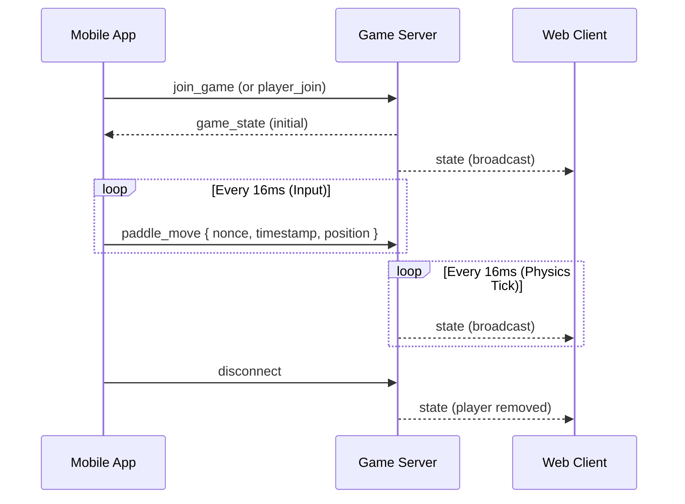
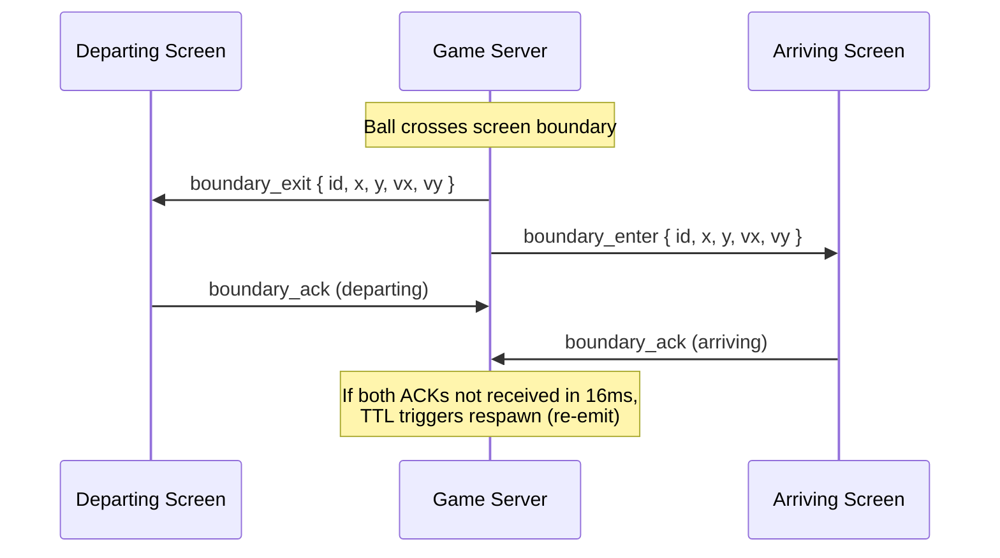
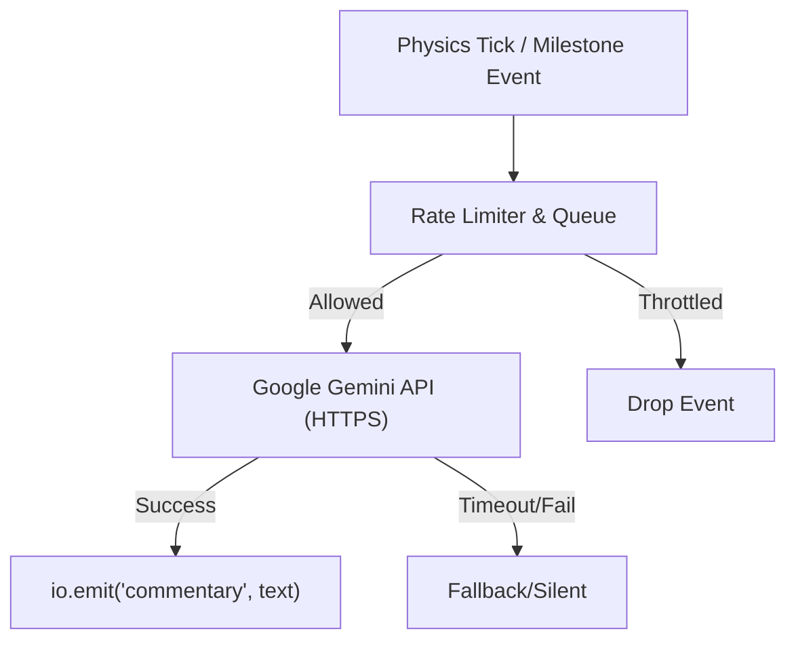
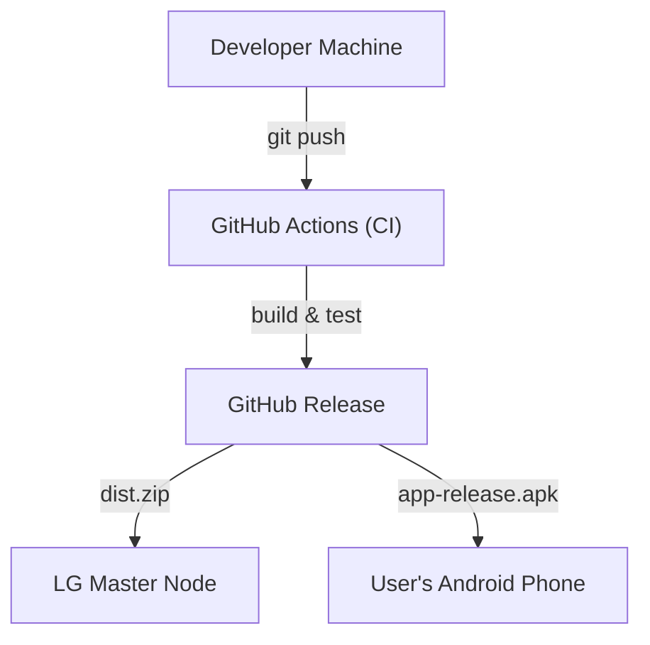

# LG-Arkanoid Architecture

## Overview
LG-Arkanoid is a distributed multiplayer game designed for the Liquid Galaxy system.
The system consists of three primary components:
1. **Node.js Game Server (Master):** Runs locally on the Liquid Galaxy master node. It manages game state, physics, networking (Socket.IO), boundary handoffs between screens, and AI commentary integration via the Gemini API.
2. **Web Client (Screens):** A Phaser 3 web application running in browser instances on the Liquid Galaxy slave nodes. Each screen loads the same client but passes a unique `screenId` parameter to render only its slice of the panoramic world.
3. **Mobile App (Controller):** A Flutter application installed on the user's phone. It discovers the master node, communicates via Socket.IO, manages SSH deployment to the rig, and sends touch/gyro paddle inputs to the game server.

## System Diagram

```mermaid
flowchart LR
    Mobile["Flutter Mobile App (Controller)"]
    Server["Node.js Game Server (Master)"]
    Gemini["Google Gemini API (AI Commentary)"]
    
    subgraph Liquid Galaxy Rig
        Server
        Screen1["Web Client (Screen 1)"]
        Screen2["Web Client (Screen 2)"]
        Screen3["Web Client (Screen 3)"]
    end
    
    Mobile <-->|Socket.IO| Server
    Mobile -->|SSH (Launch)| Server
    Server <-->|Socket.IO| Screen1
    Server <-->|Socket.IO| Screen2
    Server <-->|Socket.IO| Screen3
    Server <-->|HTTPS| Gemini
```

## Socket.IO Event Flow



## Physics & Boundary Handoff Protocol



## AI Commentary Pipeline



## Deployment



## Technology Stack
- **Server:** Node.js, Express, Socket.IO
- **Client:** HTML5, CSS3, Phaser 3
- **Mobile:** Flutter, DartSSH2, Socket.IO-Client
- **AI Integration:** Google Gemini REST API
