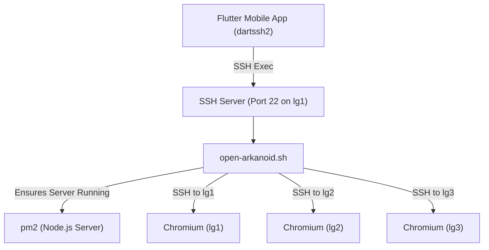

# Liquid Galaxy Setup

## Installation
1. SSH into the master node (typically `lg1`).
2. Clone the repository: `git clone https://github.com/AnirudhPratapSinghYadav/LG-Arkanoid.git`
3. Navigate to the folder: `cd LG-Arkanoid`
4. Run the installer: `sudo bash install.sh`
   - You will be prompted to enter your Gemini API Key.
   - The script sets up firewall rules, port 3000, and PM2 process management.
5. PM2 will automatically restart the server on reboot.

## Scripts
- `scripts/open-arkanoid.sh`: Launches browser instances across all slave nodes to load the game.
- `scripts/close-arkanoid.sh`: Kills the Chromium processes to exit the game.
These are invoked automatically by the mobile app.

## Launch Flow (SSH Pipeline)

